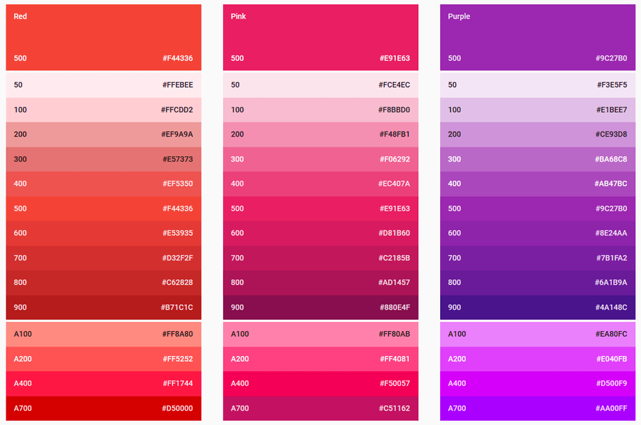
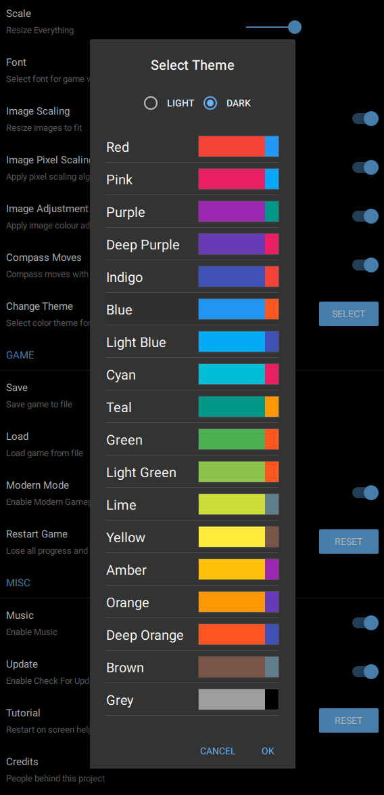

# IFI - Interactive Fiction Interface

_IFI_ is the point of connection between a GUI and an IF _back-end_, _engine_ or _interpreter_, depending on your terminology.

The purpose of _IFI_ is to convey instructions from the GUI to the _back-end_ and to convey elements of the world state from the _back-end_ to the GUI. These conveyances encode information according to an _implementation independent_ schema.

Specifically, messages in both directions are `json` strings whose schema and term meanings are detailed below. Consequently, the interface itself, needed only for passing strings is especially terse. These few functions are the interface between the GUI and the IF back-end;

```cpp
struct IFI
{
    typedef void charEmitFn(void*, const char*);

    virtual ~IFI() {}
    static IFI* create();
    
    virtual void setEmitter(charEmitFn* emitter, void* ctx) = 0;
    virtual bool eval(const char* json) = 0;
    virtual bool start(int argc, char** argv) = 0;

    virtual int sync(int timeoutms) = 0;
    virtual void release() = 0;

};
```

In practice, an adapter called `IFIClient` is linked with your back-end to make your interpreter IFI compatible. `IFIClient` contains a lot of helper functions. There's also a "C" interface called `ifiglue` that allows, an otherwise console interpreter, to become an *IFIClient* simply by redefining `stdio` function calls such as `getchar`, `putchar` etc.

## Requests and Replies

The back-end (`IFIClient`) receives json _requests_ together with game commands. The back-end then replies by sending a _reply_ json, this reply contains the answers to data requested and also text result from the game command.

`IFI::setEmitter` is called by the front-end to the back-end to give the back-end the `Emitter` function through which to reply. The back-end will use `IFIClient` as "glue" to help the connection.

The back-end can call `IFIClient::getRequest()` to **block** on the next request from the front-end. This will return the next json request. Additionally the back-end can call `IFIClient::getchar()` which will **block** until the next character of game command is returned.

NOTE that the `getRequest` json will contain any `command`, so that `getchar` is not necessary (but convenient). If `getRequest` is called, a subsequent `getchar` will not block (essentially returning characters of the `command` already obtained by `getRequest`).

## IDs

Game objects are associated with an _ID_. For the purposes of _IFI_ `json`, an _ID_ is to be regarded as a unique term. For the type of _ID_, the `json` may use integer numbers or strings. If numbers are used, the value _zero_ is reserved and should not be associated with an object, if strings are used, an empty string is invalid and should not be used.

The front end makes no assumptions about the meaning of this ID, except that equal IDs mean identical objects. 

## Startup

See _Interface_ section for details, but startup has the following sequence;

* `create`
* `setEmitter`
* `start`  
   Sends `configDir`, `dataDir` and name of `story` to back-end using `argc,argv` in `start()`. The engine will need this information to open any game story files which will contain information subsequently requested. 

   The back-end will not be expected to reply to the start `json`, but if it chooses to do so, it should not issue any `text`.
   
* `eval`  
   Sending the _request prologue_ to the back-end. This _prologue_ `json` will **not** contain any `command` terms, but will consist of requests for state such as the game `meta` information as well as requests for `map`, `items` etc. It also provides a random number.

   Example prologue:
   ```
   {"meta":true,"objects":true,"map":true,"picture":true,"items":true,"people":true,"randomseed":2394829048}'
   ```

   Note, that when automatically continuing a previous game, this _prologue_ `json` may contain `loaddata` which will send a complete game state to the back-end. Consequently, the back-end should not have issued any `text` until this point.

   The back-end should reply with responses to the prologue requests such as game `meta` details, colour theme, `objects` table and anything else it wishes to send including the game initial (or restored) `text`.

   Example prologue `meta` reply:
  ```
  {"meta":{"author":"by John Doe","backimage":"assets/cover.jpg","covertext":{"color":"blue","font":"Kanit Thin","weight":100},"credits":"<h1>The Guild2<br/><em>by Strand Games</em></h1><h4>Thanks to</h4><ul><li><p>Contributors to the <a href=\\\"https://strandgames.com/community\\\">Strand forum</a>.</p></li></ul>","organisation":"Strand Games","primary_color":"red","title":"KLIF","ui_compass":1,"ui_sidebar":1,"ui_textinput":1,"version":"1.0"}}
  ```

  Example `objects` table reply:  
  `{"objects":[{"id":1,"name":"Cute Dog"},{"id":2,"name":"Top Hat"}]}`

  Example sidebar `items` reply:  
  `{"items":[{"id":1,"name":"Cute Dog, Wagging tail"},{"id":2,"worn":1}]}`

  Note that the `name` can be omitted in an `items` reply if the display label is to be the same as the `objects` table entry.

* `eval`  
  Subsequent evals may contain any IFI request terms, including `command`. It is not essential that the back-end respond to these requests immediately and it is not an error for no `text` to be issued in response. 


## Paths

Two directories are sent with the first `json`;

* `configDir` = directory where game assets and files live  
* `dataDir` = writable direction where per-user files can live.

Things like save games and user preferences live in `dataDir`. For example, on Windows 10, this directory is `c:/user/whomever/appdata/roaming/brahman/nameofgame/`

In general, back-ends do not need `dataDir`. One such use would be a location to cache images.

`configDir` is the root of read-only assets such as game data files, pictures, audio files, icons etc. By default this directory is an `assets` subdirectory below the location of the EXE.

Both `configDir` and `dataDir` may be changed on the command line, do their locations should not be assumed anywhere. Neither should be any specific current working directory.

Where requests and replies specify `"filepath"`, this will be a path relative, either to `configDir` or `dataDir`, depending on the nature of the operation.

## Requests

These are the json tags that may appear in a _request_. See the _Replies_ section for corresponding reply data to each request.

* `configdir: "path"`  
  Directory where game assets are stored. This directory is not necessarily writable.

* `datadir: "path"`  
   Directory where user specific data is stored. eg save games.
   
* `story: "name"`  
   Prefix name of the story. Files `story`.???  will be in `configdir`

* `randomseed:` int64  
   Send random seed to back-end. This happens at startup and can be ignored. However, if the back-end uses psuedo-random numbers and needs a seed, this can be used.

* `objects: true`  
   Request the game objects table.

* `command: "get lamp"`  
   Text typed by the player, or constructed by the GUI.

* `savedata: true`  
   Request back-end to emit `savedata` with current game state.

* `loaddata: "game-state"`  
    The entire game state is sent to restore a game position. The string "game-state" is _entirely_ back-end specific, for example base64 encoded binary data, whose content and meaning is only known to the back-end. This will include any internal headers, formatting, version numbers etc.

    The "game-state" string will correspond _exactly_ to one previously sent through `savedata` earlier.

    See section "Save and Load".

* `map: true`  
   Return `map` data reply if `true`. If `false`, unsolicited updates are not needed.
   
* `picture: true`  
   Reply details of current `picture` if `true`. 
   
* `items: true`  
   Reply current `items` (eg inventory) if `true`. If `false`, unsolicited updates are not needed.
   
* `people: true`  
   Reply current `people` if `true`. If `false`, unsolicited updates are not needed.
   
* `meta: true`  
   Reply the game meta info (eg title, author etc.).
   
## Replies

The _reply_ json, sent from the back-end to the front-end, can have these terms at the top level. Some of the terms have values that are (optionally) json objects. In these cases, consult the subsequent json object definitions.


* `text: "You are in a maze of twisty passages all alike."`  
   Block of text from the game to be formatted and shown in the transcript window. A newline will be added to the end when displayed. The `text` may contain a subset of [Markdown](https://daringfireball.net/projects/markdown/) and HTML.

* `text:{textobj}`  
   Supply formatted text.

* `title: "In the Lounge"`  
  Game text to be displayed in any GUI title bar.
  
* `picture: "filepath"`  
   Path relative to `configDir` for picture file (.jpg,.png) to be displayed. PNG files may be animated (ie [APNG](https://en.wikipedia.org/wiki/APNG)).
   
* `picture: {pictureobj}`  
   Version of `picture` with more details. NB: either use this form or the above.
* `sound: {soundobj}`  
   Play a sound.

* `objects: [{object}...]`  
   The objects in the game. This is primarily the _invariant_ mapping between ID and game name.

* `savedata: {saveobj}`  
   Provide current game state _save_ to UI.

* `loaddata: "filepath"`  
    Initiate `savedata` load from the back-end.

    See section "Save and Load".

* `items: [{item}...]`  
   item details for the sidebar (eg inventory).
   
* `people: [{person}...]`  
   _Optional_. People details for the sidebar. Usually this will be people you've met.
   
* `location:` ID    
   ID of current location.
   
* `exits:` int  
   Bitmask of currently available directional exits. This data are used to drive the GUI compass. Canonical game exits follow the following predefined order; N,NE,E,SE,S,SW,W,NW,Up,Down,In,Out. The bitmask is constructed with bit 0 (LSB) being "N", and so on.

* `map: {mapobj}`  
   Data for the currently known map.
   
* `moves:` int  
  Current move count (or game time).

* `meta: {metaobj}`  
   Game meta data. This will only be requested once, usually at the start.

* `values: {key:value,...}`

* `prompt: ">"`  
  Set the prompt to the given string. The new prompt will be used in any UI entry box until subqeuently changed.

* `unuse: "unuse {1:name}"`  
  Set the `unuse` command, for menu-drop, to the given format string. The string is any text with allowable embedded substitution codes. These codes are of the following format:
  `{` _number_ `:` _key_ `}` where _number_ is the argument number (always 1 in this case), and _key_ is any of `id` or `name`. If `id` is specified, the object ID is sent. For `name`, the name is found from the `objects` table using the ID. The string above is the default.

* `usewith: "use {1:name} with {2:name}"`  
  Set the "use X with Y" command, for drag-and-drop, to the given format string. The string is any text with allowable embedded substitution codes. For the allowable codes see `unuse`. The string above is the default.

* `compassgo: "{1:id}"`  
   Set the `command` sent when a valid compass direction is clicked. `id` in this case is one of the words; "north", "northeast", "east", "southeast", "south", "southwest", "west", "northwest", "up", "down", "in" or "out". The default is to send just the word. For example if you wished to receive the `command`, `go` _direction_, the `compassgo` string would be `"go {1:id}"`.

* `refreshcmd: "look"`  
  Set the `command` sent when the refresh button is pressed.

### pictureobj

* `name: "filepath"`  
  path relative to `configDir` for image file.
  
* `brightness: 0.0`  
  _Optional_. 0.0-1.0. Applied to picture dynamically.
  
* `contrast: 0.0`  
  _Optional_. 0.0-1.0. Applied to picture dynamically.
  
* `saturation: 0.0`  
  _Optional_. 0.0-1.0. Applied to picture dynamically.

* `lightness: 0.0`  
  _Optional_. 0.0-1.0. Applied to picture dynamically.
  
* `gamma: 1.0`  
  _Optional_. Applied to picture dynamically.

### object

* `id:` ID  
   The object _ID_ (eg a symbolic string).

* `name: "game name"`  
   The _game name_ is a string that the game parser will accept to identify the object. For example, if there are several _keys_ in the game "key" is insufficient, the _game name_ must therefore be "small key", "brass key" etc. as appropriate.

* `icon: "filepath"`  
  _Optional_. Name of the default icon file for this object. Icons can be .svg or .png, but if PNG, they must have a transparency.

### item 

* `id:` ID

* `name: "label"`  
  _Optional_. The text displayed for the item (usually in the sidebar). This can be a _friendly_ name rather than a name that will parse. For example, "A small dog asleep", or "Dr. Livingstone (you presume)". This name can change, whereas the ID _game name_ cannot.

  If omitted, the label is taken from the objects table, looking up the ID.
  
* `worn:` bool  
  _Optional_. If provided, the GUI will indicate the item is worn (usually in the sidebar).
  
* `icon: "filepath"`  
  _Optional_. Icon to display in sidebar for item. This is usually a `.SVG` file. 

### person

Same meanings as `item`.

* `id:` ID
* `name: "label"`
* `icon: "filepath"` 

### mapobj

* `places: [{place}...]`  
   Array of known places.

* `location:` ID    
   _Optional_. ID of current location.
   
* `backimage: "filepath"`  
  _Optional_. background image for map page.

* `title: "text"`  
  _Optional_. Title text for map.

### place

* `id:` ID

* `name: "placename"`  
  Text to be displayed in map location box.
  
* `exits: [ID...]`  
   Current exit locations from this place. This is a list of outgoing location IDs. ie places where this location can lead to, and is **not** a list of directional exits.

* `gx:` int   
   X grid coordinate. Place locations are set on an integer X-Y grid. Imagine all locations are points on this grid and (currently) are all the same size. The map renderer will automatically figure the scale and relative offsets for the map and its consequent plot coordinates. `X` coordinates are left-right.
   
* `gy:` int  
  Y grid coordinate. `Y` coordinates are `top-down` the page and **not** up.
  
* `dark: true`  
  _Optional_. Map location is _dark_. If set this will draw the map box in a darker shade.
  
* `up:` bool  
  _Optional_. Indicate _Up_ arrow on map box.

* `down:` bool  
  _Optional_. Indicate _Down_ arrow on map box.
  
* `items: [ID...]`  
  _Optional_. Specify IDs of items in mapbox. This can be used to show the location of _dropped_ items on the map.

### metaobj

* `title: "name"`
* `author: "name"`
* `organisation: "name"`
* `covertext: {textobj}` 
* `credits: "by Larry Biggs"`

* `version: "1.2.0"`  
  The string should contain a number of this format X.Y.Z.

* `android_market: ""`  
   _Optional_. Google Play marketplace link.
   
* `ios_market: ""`  
  _Optional_. Apple Store marketplace link.
  
* `backimage: "filepath"`  
   _Optional_. Background Image to display on game cover, path relative to `configdir`.

* `effect: "filepath"`  
   _Optional_. Filename containing shader to display on cover page.

* `ui_sidebar: true`  
  _Optional_. enable sidebar. Default is false.

* `ui_textinput: true`  
  _Optional_. Enable text input. Default is false.

* `ui_compass: true`  
  _Optional_. Enable UI compass. Default is false.

* `primary_color: "deep orange"`  
  _Optional_. Set theme primary colour from Material Design palette. See section on "Themes and Colours".

* `contrast_color: "indigo"`  
  _Optional_. Set theme contrasting colour from Material Design palette. **important:** You do not need to send this value, simply provide the `primary_color` and the `contrast_color` will be automatically selected.

* `autolink: true`
  Switch on or off the _autolinking_ feature of the GUI. This is the process of automatically converting the output text into markdown using the `objects` table.

* `saveload: true`  
   Enable save/load UI in app.

* `ui_restart: true`  
   Enable restart button in app.

### saveobj

* `data: "game-state"`  
   The entire game state encoded as a string (eg base64) that can later be accommodated by a `loaddata` request to completely restore a position (see also request `loaddata`).

* `name: "filepath"`  
   _Optional_. path relative to datadir.
  
### textobj

* `text: "string"`  
  _Optional_.

* `font: "name"`  
  _Optional_.
  
* `weight: int`  
  _Optional_.
  
* `color: "blue"`  
  _Optional_.

* `id:` int  
   Used internally as channel number. `-1` clears any previous text

### soundobj

* `name: "filepath"`

* `duration: int`  
   play `int` times. A value of 0 means; stop playing any existing sounds. A value of `-1` means play continuous loop.

* `channel: int`
   _Optional_. Specify audio channel, default to 0.

## Save and Load

The actual saving and loading of data to files is performed by the front-end. In order to do this, the back-end must be able to send and receive a complete game state across _IFI_.

The game state can be arbitrary back-end data. _IFI_ treats this data as an opaque _blob_ which it saves and loads to files. It is therefore vital that the back-end can accept it's own save data back in the exact same form and format as it gave out in the first place.

Although the data "blob" may well start and end it's journey as binary data, for the purposes of _IFI_, it has to be transmitted within a JSON string. For that to be possible the data in question needs to be encoded into allowable JSON string ASCII. Example encodings are base64 and base85.

`IFIHandler` provides a suitable base85 codec to make this easy. However, the particular choice of encoding is entirely up to the back-end engine, since _it_ is the only entity that needs to make sense of this data. 

Save and Load is usually initiated from the GUI, but if command line input is provided by the game, it can start there. The sequence of events is slightly different in each case;

### Save Initiated by the GUI

Note here that the reply does not contain a `name`, any filename given in the reply will be ignored since the GUI has already been given the filename by the user (or is implied).

If the save fails for any reason the user will be notified via the GUI.

| Direction | Message |
| ----------|---------|
| front → back | `savedata:true` |
| back → front | `savedata:{data:"blob"}` |

### Load Initiated by the GUI

Here, the back-end is sent a new game state directly. This can happen at any time. There is no expected reply to this since it is assumed to always be valid.

| Direction | Message |
|-----------|---------|
| front → back | `loaddata:"blob"` |

### Save Initiated by the Engine

In this version a `name` can also be also supplied. The given filepath will be relative to the `dataDir`. Note: that any filename confict with an existing file will be overwritten.

Note that `name` is optional. If omitted, a name will either be generated by the GUI _or_ a name will be requested from the user.

If the save fails for any reason the user will be notified via the GUI.

| Direction | Message |
|-----------|---------|
| back → front | `savedata:{data:"blob",name:"filepath"}` |

### Load Initiated by the Engine

In this variant, the name of the file, relative to `dataDir` is provided by the engine. If the file does not exist or cannot be opened, or is not a save file or for _any_ other reason, the user is notified via the GUI.

If the file is located, it is read and the save data "blob" sent to the back-end. Is is assumed that this is valid and will be accepted.

If an empty _filepath_ is provided, the GUI will prompt the user for the file to load, since unless the "save" was previously issued by the engine, there would be no way for the engine to know the filename. Nevertheless, the _filename_ can be given if known.


| Direction | Message |
|-----------|---------|
| back → front | `loaddata:"filepath"` or `loaddata:""` |
| front → back | `loaddata:"blob"` |

## Themes and Colours

The GUI uses the [_Material Design_](https://material.io/design/color/) colour palette.

Each of the colour themes has a primary colour and a secondary contrasting colour, and all choices also come in light or dark - that's to say against a light background or a dark one.

The colours are all chosen from the Material Design spectrum. Each primary colour is matched with a corresponding contrasting colour from the same spectrum but darkened in shade.


Each color comes in a number of light to dark shades. Many of these shades are used in parts of the user interface, chosen automatically from the theme base primary color (signified by shade 500).

Here are three swatches from the wheel above;



counting clockwise from _red_, the base colour names are as follows;

* red
* pink
* purple
* deep purple
* indigo
* blue
* light blue
* cyan
* teal
* green
* light green
* lime
* yellow
* amber
* orange
* deep orange
* brown
* blue grey
* grey

Also added are:

* black
* white

If the above names are used for `primary_color`, the appropriate material design colour (shade 500) is selected together with a suitable contrasting colour. Note that `contrast_color` does not have to be specified.

Alternatively a `primary_color` can be chosen **not** from the _Material_ palette, but from the [SVG Color Names](https://www.w3.org/TR/SVG/types.html#ColorKeywords), or _even_ as a hex string `"#rrggbb"`

_However_, it is important to understand that the user can only select colours from the _Material_ palette, as shown by this theme picker:



If you provide custom colours to `primary_color` and/or `contrast_color`, they will be used initially, but the user has _no way_ to revert to them if a replacement theme is subsequently selected.


## Interface Functions

#### `IFI* create()`

Is the first function to be called. Note this is not an interface function, but statically linked. The `create` function pulls in linkage to `ifigame.dll` and creates the `IFIClient` internal to the back-end.

#### `void setEmitter(charEmitFn* emitter, void* ctx)`

This will be called shortly after `create`, but _before_ anything else. `setEmitter` is passed a callback function to that the back-end can send JSON.

#### `bool start(int argc, char** argv)`

Called after `setEmitter` but before any `eval`. Tells the back-end to perform startup and initialisation. When linked through `ifiglue`, `start` will wind up calling into the original console `main`.

Arguments passed are from the original invocation (if any).

Additionally, the argument `-e <json>` will be included in order to send the back-end necessary information it needs to start up. This is limited to the following terms:

* `configdir`
* `datadir`
* `story`

See the _requests_ section for description of these terms.

After calling `start`, the host will call `eval` with additional `json` _before_ any `command`. This is known as the request _prologue_ and  allows the back-end to perform a secondary startup, before producing output.

For example, the request prologue may contain a `loaddata` request so that the game can continue from a save.

#### `bool eval(const char* json)`

Send request `json` to back-end.

#### `int sync(int timeoutms)`

Wait `timeoutms` for engine to block. return `true` if engine sucesfully blocked, in which case engine is now waiting for `release`. Return `false` if timeout reached and engine not ready.

#### `void release()`

Release back-end to execution after `sync`.

## Special Eval Commands

Within an `eval`, some `command`s are sent from the GUI that have special meaning and correspond to user operations;

These commands work like game "verbs";

### `use` _object_  
Is normally passed back when an object is clicked on. This may be the direct result of the text given in the first place and therefore may be adjusted to anything. For example;

```
"There is a [key](use key) here"
```

If previously sent within the text stream will cause the `command` `"use key"` to be sent to eval when clicked.

### `unuse` _object_

Sent when an object is dragged from the sidebar menu and dropped onto a blank text area. This corresponds to a "drop" command, but the verb `"unuse"` is sent so as to allow the back-end to act differently if needed. In most cases, `unuse` may be safely mapped to `drop`.

The command `"unuse X"` is formed where `X` is taken from the `name` within the `objects` table, found from the `id` given to the `items` list. Note that the `name` label within the original `items` list is ignored, as this is taken as a display string rather than a valid parsable object reference.

The command string generate for an `unuse` event may be changed, see `unuse` reply.

### `use` _X_ `with` _Y_

When an item `X` is dragged from the sidebar menu onto item `Y` in the text. See `usewith` reply for details of how the command is built.


