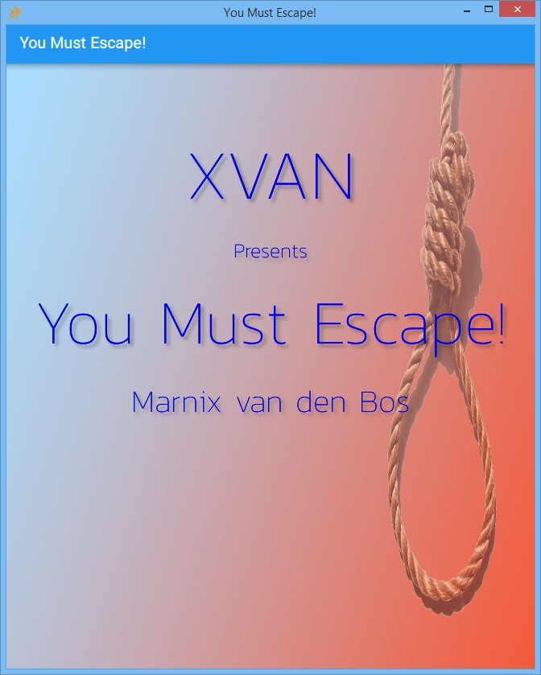
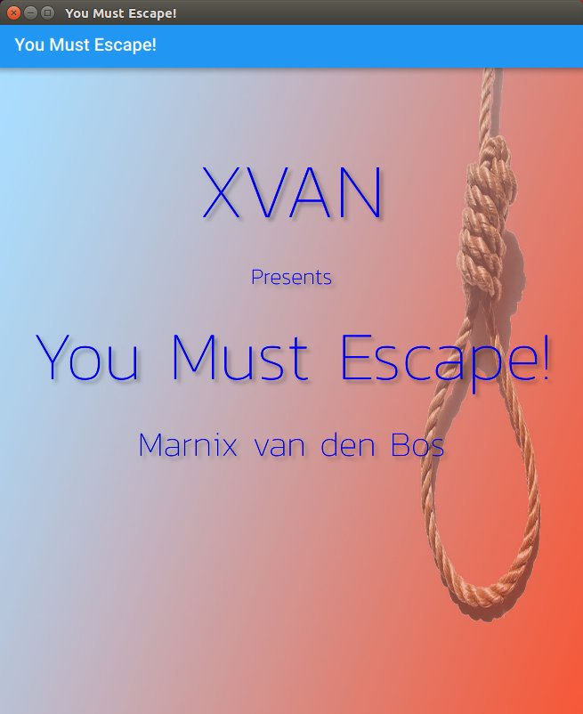

# Build Brahman Instructions

## Prerequisites

install Qt

Download 5.9.X branch from;
https://www1.qt.io/offline-installers/

### Windows

Get Qt 5.9.X for Windows
run the exe. install to eg `c:\qt\qt5.9.6`

* select: MinGW 5.3.0 32 bit
* Also select tools/mingGW 5.3.0 if you do not already have a mingw environment.

add to `PATH` (adjust according to location)

eg.
```
C:\Qt\Qt5.9.6\5.9.6\mingw53_32\bin;c:\Qt\Qt5.9.6\Tools\mingw530_32\bin;C:\Qt\Qt5.9.6\Tools\QtCreator\bin
```

### Linux

Get Qt 5.9.X for Linux 64 bit.

File is a ".run" file.
eg `sudo ./qt-opensource-linux-x64-5.9.6.run`

install to `/opt/Qt5.9.6`
select "desktop gcc 64bit"

add to `~/.bashrc`

```
export PATH=/opt/Qt5.9.6/5.9.6/gcc_64/bin:/opt/Qt5.9.6/Tools/QtCreator/bin:$PATH
```

### MAC OSX

Download Qt 5.9.X 

eg.
`open qt-opensource-mac-x64-5.9.6.dmg`

install to `/Developer/Qt5.9.6`
Select "mac os"

Change `PATH` in `~/.bash_profile` to;

```
export PATH=/Developer/Qt5.9.6/5.9.6/clang_64/bin:/Developer/Qt5.9.6:$PATH
```
 
## Build Instructions (all platforms)

```
qmake -r
make  
```

(or `mingw32-make` if you do not have make installed.)

which will build:
* tools/zlib
* tools/apng/libpng_apng/libpng
* ifi
* api
* app
* xvan & xvan/xc

### Build XVAN Escape Demo

**Windows**
(see xvan/escape/src/b.bat)
```
cd xvan/escape/src
..\..\xc\release\xc -i escape.xvn -o escape.dat
copy escape.dat ..
```

**Linux** and **Mac OSX**
(see xvan/escape/src/b.sh)
```
cd xvan/escape/src
../../xc/release/xc -i escape.xvn -o escape.dat
cp escape.dat ..
```

### Run XVAN Escape GUI Demo

**Windows**
(see xvan/escape/go.bat)

Looks like this:



```
cd xvan/escape
..\..\app\release\klif.exe -configdir . -story escape.dat
```

**Linux**

Looks like this:



(see xvan/escape/go.sh)
```
cd xvan/escape
export PWD=`dirname $0`
export TOP=$PWD/../..
export APP=$TOP/app/release
export LD_LIBRARY_PATH=$APP:$LD_LIBRARY_PATH
$APP/klif -configdir . -story escape.dat
```

**Mac OSX**
(see xvan/escape/gomac.sh)

Looks like this:


```
export PWD=`dirname $0`
export TOP=$PWD/../..
export APP=$TOP/app/release
export DYLD_LIBRARY_PATH=$APP
appname=klif
$APP/${appname}.app/Contents/MacOS/${appname} -configdir . -story escape.dat
```

## Deployment

You can copy the binaries and resources together so that the game can be launched by clicking on the binary as follows;

* rename the binary to the game name
* copy all DLLs locally to the game binary
* create a subdirectory called `assets`
* copy all images, icons etc into the `assets` subdirectory

### Example for Escape

(from `escape/xvan` directory)

```
mkdir dist
cp ../release/ifigame.dll dist
cp ../../app/release/*.dll dist
cp ../../app/release/klif.exe dist/escape.exe
mkdir dist\assets
cp escape.dat dist/assets
cp -r images dist/assets
cp -r icons dist/assets
```

Be sure to put the `images` and `icons` directories _inside_ the `assets` directory in the same arrangement as they are relative to `-configdir` as ran before.

### Changing the Icon

If you wish your deployed binary to have its own internal icon, you have to change `app/klif.pro` to specify it.

For Windows, set `RC_ICONS` to an `.ico` file and for OSX make an `.icns` file

eg.

```
win32 {
   RC_ICONS = pathto/yourlogo.ico
}
```

For OSX change `ICON`

eg.

```
macx:  {
   ICON = pathto/yourlogo.icns
}
```


## Build Instructions for Debug

### Windows

```
qmake
make debug
```

### Lunux & OSX
```
qmake -r CONFIG+=debug
make
```

### Run XVAN Escape GUI Demo (debug)

**Windows**
(see xvan/escape/godb.bat)

```
cd xvan/escape
copy ..\debug\ifigame.dll ..\..\app\debug
"..\..\app\debug\klif.exe" -d 3 -configdir . -story escape %1 %2
```

**Linux**
(see xvan/escape/godb.sh)
```
export PWD=`dirname $0`
export TOP=$PWD/../..
export APP=$TOP/app/debug
export LD_LIBRARY_PATH=$APP:$LD_LIBRARY_PATH
$APP/klif -d 3 -configdir . -story escape
```

**Mac**
(see xvan/escape/gomacdb.sh)

```
export PWD=`dirname $0`
export TOP=$PWD/../..
export APP=$TOP/app/debug
export DYLD_LIBRARY_PATH=$APP
appname=klif
cp ../debug/*.dylib $APP
$APP/${appname}.app/Contents/MacOS/${appname} -d 3 -configdir . -story escape
```


