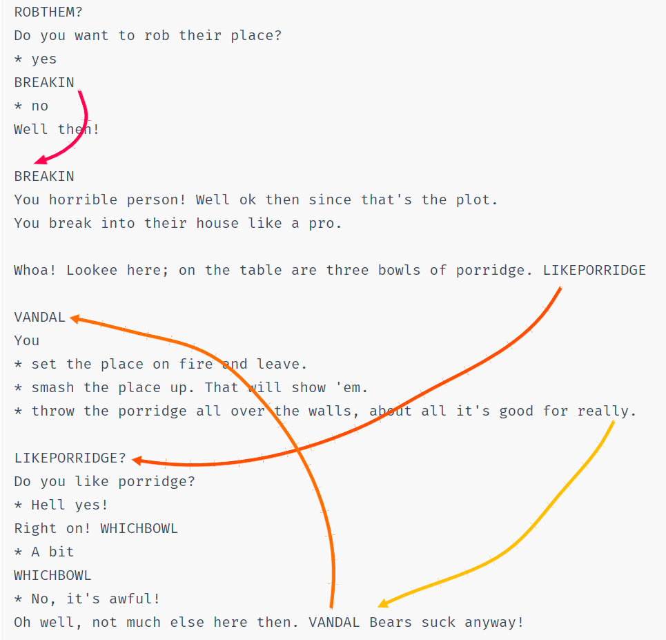

# Strand IF Authoring

<div>
<p style="float:left; font-size: 10pt;height:100px; margin-right: 1%; margin-bottom: 1.5em;">Strand Games Technology</p>
<p style="float:right; font-size: 10pt; text-align: center; height:100px; margin-right: 1%; margin-bottom: 1.0em;">Remasters & Sequels</p>
</div>

<p style="clear:both;"></p>


## Introduction

Strand Games has developed a novel technology for IF production called `Strands`.

Easily make parser IF, choice IF and anything in between with no programming. Deploy to mobile, desktop or the web with a GUI supporting pictures, animation and sound.

Historically, IF systems were designed around computer limitations at the expense of creativity. `Strands` turns this around and puts creative authoring in the lead.

`Strands` does not claim to be more capable than other systems, nor does it claim to be better or have more features. Instead, `Strands` strives to be quick and easy to use while following simple ideas.

* Write your game in your favourite editor as a text file.
* Use a single "building block" in a variety of ways to make your game.
* Don't let the 10% of complicated features poison the simplicity of the 90%.

The documentation will show you how _one simple building block_ is used in different ways to build diverse and functional games, expressing content generation, choices, world building and text input.

Anyone can use `Strands`. Write your game in your favourite editor, then run it immediately!

`Strands` is all open source!


## Fundamental Ideas

### Terms


_Flow_ is a fundamental concept. Flow is the way in which the event sequence of a story unfolds.

Here is a story;

```
STORY
Once there were three bears, they all died!
The End.
```

OK, not a very exciting story (or even very original), but it illustrates the building block called the _term._

**Anything in capital letters is a _term_ and the rest is _flow._**

`STORY` is a _term_ and the text, "Once there were three bears, they all died! The End." is its _flow._ Let's run this story and see the output;

> Once there were three bears, they all died! The End.

Line breaks in flow do not appear in the output. You can however have blank lines in text flow, for example;

```
STORY
Once there were three bears, they _all_ **died!**

**The End.**
```

Produces the output;

> Once there were three bears, they _all_ **died!**
>
> **The End.**

Notice you can use markdown in text to indicate **bold** and _italic._

Let's put in some more terms;

```
STORY
ONCE there were THREE bears, then they all died!
The End.

ONCE
Once

THREE
three
```

This produces the exact same output as before, except now the terms `ONCE` and `THREE` emit their own flow.

NOTE: Sometimes you want a capitalised word in the text. In this case, just prefix the word with `\` (backslash) to escape it. Examples: `\OK`, `\TV`. For frequent cases, you can make a term which returns the text, eg:

```
OK
\OK
```


### Selectors

Now, we can give these terms branching flow using _selectors._ For example;

```
STORY
ONCE there were THREE bears, then they all died!
The End.

ONCE
* Once
* Once upon a time
* A long time ago

THREE
* two
* three
* four
* five
```

The term `ONCE` has three _selectors_ which give alternative flows. `ONCE` will choose one of the three selectors _randomly._ The same for `THREE`.

Now we get random stories, each time we run!

> Once upon a time there were five bears, then they all died! The End.

> A long time ago there were four bears, then they all died! The End.

So, just with these bear-bones (sic) basics, we can already make stuff;

```
STORY
ONCE there were THREE bears, PART1. DIED. THEEND

ONCE
* Once
* Once upon a time
* A long time ago

THREE
* two
* three
* four
* five

PART1
* they were forced into lockdown in their HOUSE
* they all lived in a HOUSE

HOUSE
* small cottage
* tiny house
* woodland shack
* garden shed

DIED
Unfortunately they
* contracted VIRUS
* were poisoned by POISON

  and died

POISON
* tainted porridge
* a little blond girl
* dodgy mushrooms

VIRUS
* Covid19
* a nasty flu
* tuberculosis
* the plague

THEEND
* The End.
* It's all over.
* That's the end!
```

Some sample outputs;

> A long time ago there were five bears, they were forced into lockdown in their garden shed. Unfortunately they were poisoned by a little blond girl and died. It's all over.

> Once upon a time there were two bears, they all lived in a woodland shack. Unfortunately they were poisoned by tainted porridge and died. It's all over.

> Once upon a time there were four bears, they were forced into lockdown in their woodland shack. Unfortunately they contracted tuberculosis and died. That's the end!

You can have text _before_ selectors and/or more text _after_ selectors (eg `DIED`) but you **cannot have more than one set of selectors in a term**. You'll see why in the next section.


### Sticky Selectors

A problem with random selectors is that sometimes you need to pick something at random and then stick with it. For example, a person's name.

Here's an example where we want to be random, but maintain consistency;

```
STORY
MARY had a little LAMB its FLEECE was WHITEASSNOW.
And everywhere that MARY went, the LAMB was sure to go.

MARY!
* Mary
* Larry
* Barry
* Harry
* Gary
* Sally

LAMB!
* lamb
* chicken
* puppy
* dog
* cat

FLEECE
* fleece
* coat
* fur
* tail

WHITEASSNOW
* white as snow
* red as blood
* green as grass
* pink as a fairy
* blue as sky
```

In this example, the terms `MARY` and `LAMB` have the _indicator_ `!` after their definition, but not their usage in the `STORY`.

The `!` indicates the term is _sticky._

A _sticky_ term is one whose flow occurs just _once_ and thereafter the flow output remains the same.

Here's some outputs;

> Larry had a little puppy its fur was green as grass. And every where that Larry went the puppy was sure to go.

> Harry had a little chicken its tail was red as blood. And every where that Harry went the chicken was sure to go.

Unfortunately, it doesn't always rhyme anymore!

There are other indicators you can apply to a term such as ones to control the ordering, the randomness and so on.

### Term Indicators

These affect the manner in which selectors are used.

Here are the possible term indictors, many of these are explained later.

Indicator | Name | Description 
-- | -- | -- 
`!` | sticky | Runs flows _once_ thereafter emits the same output.
`&` | shuffle | Selectors are "shuffled" and executed in a random order.
`#` | nonrandom | Selectors chosen with biased random preventing starvation.
`<` | sequence | Selectors run in order.
`=` | first | First valid selector is run.
`$` | all | Run _all_ the selectors in order.
`?` | choice | Term is a choice.
`@` | object | Term is an object.

### Choices

So far we've only covered terms used as generators. But;

**The difference between a player choice and a generator is whether the choice is made by the _player_ or by the _machine._**

When you want to make a player choice, you use the _exact same syntax_ but mark the term as a choice using `?`.

Here's a new story to illustrate;

```
STORY
Once upon a time there were three bears.

What's your name? NAME
Ok NAME, here's the deal, the three bears have just gone out for a walk.
ROBTHEM That's the end of the game.

NAME?!
* Goldilocks
* Mousilocks
* Dreadlocks

ROBTHEM?
Do you want to rob their place?
* yes
BREAKIN
* no
Well then!

BREAKIN
You horrible person! Well ok then since that's the plot.
You break into their house like a pro.

Whoa! Lookee here; on the table are three bowls of porridge. LIKEPORRIDGE

VANDAL
You
* set the place on fire and leave.
* smash the place up. That will show 'em.
* throw the porridge all over the walls, about all it's good for really.

LIKEPORRIDGE?
Do you like porridge?
* Hell yes!
Right on! WHICHBOWL
* A bit
WHICHBOWL
* No, it's awful!
Oh well, not much else here then. VANDAL Bears suck anyway!

WHICHBOWL
There are three bowls; a large one, a medium one and a small one. BOWL

BOWL?
Which do you want to try NAME?
* the biggest of course!
Eww! It's cold and lumpy! BOWL
* the medium sized one
Eww! It's way too sweet! BOWL
* the smallest one
This one's not too bad. A bit small though, so you eat the lot!
Suddenly the door slams open and three angry bears are glaring right at you! WHATNOW

WHATNOW?
What now?
* Run like hell!
Nice try, but they swiftly block your exit. MAULED
* Climb a tree.
Be serious, there are no trees in here! WHATNOW
* Put your hands up and plead innocent.
Sorry, the cute routine doesn't work with bears! MAULED
* Say; NAME went that-a-way, and point out the window!
It worked! The bears all rush out to find the culprit.
Quickly, you exit the shack and run away as fast as you can. That was close! MORAL
* Fight!
You rush them, kicking and screaming like a banshee, perhaps they'll run off? MAULED

YOUDIE
They
* leave you to die slowly and painfully,
* watch you die slowly, your blood squirting out in slow motion,
* laugh as you die screaming in agony,

  while they eat their porridge!

VICIOUSLY
* viciously
* ferociously
* mercilessly
* easily

MAULED
The bears grab you and VICIOUSLY tear all your arms and legs off! Bears are _that_ strong you know. YOUDIE MORAL

MORAL
Perhaps you won't mess with bears next time!
```

Let's see how this plays and explain the details;

> Once upon a time there were three bears.
> 
> What's your name?
> (1) Goldilocks
> (2) Mousilocks
> (3) Dreadlocks
> 2
> 
> 
> Ok Mousilocks, here's the deal, the three bears have just gone out for a walk. Do you want to rob their place?
> (1) yes
> (2) no
> 2
> 
> Well then! That's the end of the game.

The flow taken by this short playthrough is illustrated here;


Here's another, slightly longer play;

> Once upon a time there were three bears.
> 
> What's your name?
> (1) Goldilocks
> (2) Mousilocks
> (3) Dreadlocks
> 1
> 
> 
> Ok Goldilocks, here's the deal, the three bears have just gone out for a walk. Do you want to rob their place?
> (1) yes
> (2) no
> 1
> 
> 
> You horrible person! Well ok then since that's the plot. You break into their house like a pro.
> 
> Whoa! Lookee here; on the table are three bowls of porridge. Do you like porridge?
> (1) Hell yes!
> (2) A bit
> (3) No, it's awful!
> 3
> 
> Oh well, not much else here then. You throw the porridge all over the walls, about all it's good for really. Bears suck anyway! That's the end of the game.

Here's the flow this time;




You can see from these flow diagrams that flow enters terms and continues to flow into subterms until there is nowhere for it to go, at which point, it returns to the original flow and continues. When the flow finally stops, the game is over.

Finally, here is a longer play;


> Once upon a time there were three bears.
> 
> What's your name?
> (1) Goldilocks
> (2) Mousilocks
> (3) Dreadlocks
> 1
> 
> 
> Ok Goldilocks, here's the deal, the three bears have just gone out for a walk. Do you want to rob their place?
> (1) yes
> (2) no
> 1
> 
> 
> You horrible person! Well ok then since that's the plot. You break into their house like a pro.
> 
> Whoa! Lookee here; on the table are three bowls of porridge. Do you like porridge?
> (1) Hell yes!
> (2) A bit
> (3) No, it's awful!
> 1
> 
> 
> Right on! There are three bowls; a large one, a medium one and a small one. Which do you want to try Goldilocks?
> (1) the biggest of course!
> (2) the medium sized one
> (3) the smallest one
> 1
> 
> Eww! It's cold and lumpy!
> Which do you want to try Goldilocks?
> (1) the medium sized one
> (2) the smallest one
> 2
> 
> 
> This one's not too bad. A bit small though, so you eat the lot! Suddenly the door slams open and three angry bears are glaring right at you! What now?
> (1) Run like hell!
> (2) Climb a tree.
> (3) Put your hands up and plead innocent.
> (4) Say; Goldilocks went that-a-way, and point out the window!
> (5) Fight!
> 2
> 
> Be serious, there are no trees in here!
> What now?
> (1) Run like hell!
> (2) Put your hands up and plead innocent.
> (3) Say; Goldilocks went that-a-way, and point out the window!
> (4) Fight!
> 1
> 
> Nice try, but they swiftly block your exit. The bears grab you and viciously tear all your arms and legs off! Bears are _that_ strong you know. They leave you to die slowly and painfully, while they eat their porridge! Perhaps you won't mess with bears next time! That's the end of the game.

It should now be clear how the flow works in this playthrough, but let's look at choice terms in a detail;

```
LIKEPORRIDGE?
Do you like porridge?
* Hell yes!
Right on! WHICHBOWL
* A bit
WHICHBOWL
* No, it's awful!
Oh well, not much else here then. VANDAL Bears suck anyway!
```

`LIKEPORRIDGE` is a choice term as indicated by `?`. It has an (optional) initial text flow `Do you like porridge?`, then it has three selectors each introduced by `*` at the start of a line.

You'll notice each selector has two parts:

* The _choice_ flow on the same line as `*`.
* The _action_ flow on the subsequent lines.

eg

```
* Hell yes!   // choice flow
Right on! WHICHBOWL // action flow
```

If the choice is selected, the _action_ flow is taken. Terms can also occur in the choice flow as `NAME` in the following;

```
BOWL?
Which do you want to try NAME?
* the biggest of course!
Eww! It's cold and lumpy! BOWL
* the medium sized one
Eww! It's way too sweet! BOWL
* the smallest one
This one's not too bad. A bit small though, so you eat the lot!
Suddenly the door slams open and three angry bears are glaring right at you! WHATNOW
```

You'll also notice some of the actions in the `BOWL` term reference `BOWL` itself. This causes a loop back to the `BOWL` term.

By default, choice terms remember which choices have previously been used and these do not appear again. For example the option `Climb a tree` did not appear again when the options were presented again. The same happened as the different porridge bowls were chosen. 

It turns out that selectors can also have indicators, and this can be used to tweak behaviour. eg. Indicating `*+ Climb a tree.` allows the option to be used more than once.

### Conditionals

We can give selectors conditionals to allow them to be affected by previous choice decisions.

**Selectors can be conditional in _both_ generator _and_ choice terms.**

The good news for non-programmers is that there are no, programming style, _variables_ in this language. Instead conditionals are built from whether terms have been visited or not.

_Programmers' note: Don't panic; you can have code flows!_

As usual, here's a mini game, and then some explaination.

```
STORY
Once upon a time there was a boy called Jack. He lived with his widowed mother. They were very poor. All they had was a cow.

You are Jack. One day your old mother says you must take the cow and sell it at the market, as there is no money left for food.

Along the way you meet OLDMAN, he offers you some "magic beans" in exchange for the cow. DOSELL \nThe End.

OLDMAN
* a demented
* a funny looking
* a peculiar
* an incontinent

  old man with a white beard

BODYPART&
* shins
* head
* groin
* chest

DOSELL?
Do you?
* Trade the cow for the beans.
You give the cow to the old man and pocket the beans, almost immediately regretting the decision. What will you poor old mother say? You return home. GOTBEANS
She throws the beans out the window, "No dinner for you!". You go to bed.
\nYou wake up next morning to discover a giant "beanstalk" in the garden, rising far up into the clouds. CLIMB
* Reject the stupid old man's offer
You tell him to get stuffed!
CASHCOW POOR
* Kick him in the BODYPART and take his beans!
ATTACKMAN

ATTACKMAN
* Oof! The old man doubles up in pain and collapses! You take his silly beans and kick him in the BODYPART for good measure. CASHCOW GOTBEANS "Oh well!" and chucks the beans in the curry. POOR
* The old man deftly doges your attack and retaliates. Turns out he's a Kung Foo master (couldn't you tell!). He kicks you right in the BODYPART, flooring you instantly! LOSE

POOR
You got dinner, POORLOSE

POORLOSE
but you're still poor and soon run out of food and starve. LOSE

GOTBEANS
Your mother looks at the beans in disgust, "What's this trash!", she says!

CASHCOW
At the market, you sell the cow for a good price and return home.
Your mother cooks a giant curry with the money from the cow.


CLIMB?
DOCLIMB do you?
*?!CHICKEN Climb the beanstalk
ATTOP
*+?CHICKEN Climb back up the beanstalk
ATTOP
* Go to the pub.
PUB
* Hang around the town like a lemon.
You do that, POORLOSE

DOCLIMB<
* With nothing better to do, 
* This time,

PUB
You go to the pub, and do some cleaning in exchange for a beer, POORLOSE

SMOKE
* crack
* weed
* hashish
* // blank

GIANTDOING
* smoking SMOKE.
* reading the newspaper.
* watching \TV.
* playing a computer game.
* grinding some bones.
* eating toast.

ATTOP?
At the top you see a huge castle fit for a giant. Do you?
* Enter the castle
Inside the castle is an enormous hall.
At the far end sits a huge fat giant, GIANTDOING Luckily he hasn't seen you. In the middle of the room is a table atop of which is; a hen, a magic harp and a bag of old coins. WHATDO
* Climb back down to get some weapons.
CHICKEN

CHICKEN
Chicken! Back at the bottom, you remember you're a pauper and haven't got any weapons. Perhaps if you did you could rob the rich. Or Something. Your mother says, "Get back up that beanstalk and bag us a golden goose, idiot!" CLIMB

WHATDO?
What now?
* Introduce yourself to the giant.
You go up to him, holding out your hand and say, "Hi! I'm Jack, nice to meet you!". INTRO
* Steal the coins
GETCOINS THIEF
* Steal the hen
GETHEN THIEF
* Steal the harp
GETHARP THIEF

INTRO
* The giant shakes your hand saying, "Hi I'm a giant, would you like some tea?"
You accept and have a nice little chat about all the problems giants have who live atop of beanstalks and what bad press they get. Presently you bid farewell and climb down. Its always good to make new friends, POORLOSE
* The giant grabs your hand, holds you down, then bites your head clean off! He kicks your head around the room for amusement then gets to work grinding your bones. LOSE

THIEF
You thief! SOUND He bellows;

Fee-fi-fo-fum!
\nI smell the blood of an Englishman,
\nBe he alive, or be he dead,
\nI'll grind his bones to make my bread!
\n\nRUNAWAY

SOUND
*?GETCOINS The giant hears the sound of the coins jangling.
*?GETHEN The Hen squawks as you grab it alerting the giant.
*?GETHARP The strings of the harp strum a note which alerts the giant.

RUNAWAY?
You run like hell! But the giant's huge stride is catching you fast. You;
* Hide under a table.
Nice try, the giant lifts the table then pounds it back down squashing you to death! LOSE
* Turn and fight the giant.
This is not David and Goliath you know! With a single punch, the giant knocks you out. You're put into the curry pot and eaten for dinner. That's after he grinds your bones of course! LOSE
* Jump out the window.
A bit risky, but hey!
Dangling on a branch, you only just make it.
You climb down the beanstalk as fast as you can.
At the bottom, you quickly fetch the axe and chop it down.
You hear a crash in the distance. Looks like you had a lucky escape there!
You show BOOTY to your old mother who says, REVIEW

BOOTY
*?GETCOINS the bag of coins
*?GETHEN the hen
*?GETHARP the harp

REVIEW
*?GETCOINS "Wow gold coins! Well done Jack." Later you buy a bigger house and employ servants to do all the grotty jobs you used to do. WIN
*?GETHEN "Only a scrawny hen!" Well i guess we might get some eggs off it. You've no idea if it lays golden eggs as, apparently, it would need to be fed golden nuggets, none of which you have. Instead you feed it grain, but hey it could be worse!
*?GETHARP "We need money, not music!" She tosses it out the window, POORLOSE

WIN
You live happily ever after!

LOSE
You have lost!

GETCOINS
You grab the bag of coins.

GETHEN
You grab the hen.

GETHARP
You take the harp.
```

This mini game of "Jack and The Beanstalk", consists mostly of simple choice terms as we've seen before. A few `\n` are thrown in, to force a newline in the output to make it a bit neater.

You can climb the beanstalk more than once so let's look at the `CLIMB` term;

```
CLIMB?
DOCLIMB do you?
*?!CHICKEN Climb the beanstalk
ATTOP
*+?CHICKEN Climb back up the beanstalk
ATTOP
* Go to the pub.
PUB
* Hang around the town like a lemon.
You do that, POORLOSE

DOCLIMB<
* With nothing better to do, 
* This time,
```

The initial flow of `CLIMB` could just be "do you?", but instead we want to say;

* "With nothing better to do, do you?"
  initially.
* "This time, do you?"
  thereafter.

This is done using the `DOCLIMB` term with a sequential `<` indicator, which will select the options in order and stay on the last thereafter.

At the top of the beanstalk (`ATTOP`), you get the option to climb down, which results in being called a "chicken";

```
CHICKEN
Chicken! Back at the bottom, you remember you're a pauper and haven't got any weapons. Perhaps if you did you could rob the rich. Or Something. Your mother says, "Get back up that beanstalk and bag us a golden goose, idiot!" CLIMB
```

`CHICKEN` flows back to to `CLIMB`. And now we see how `CLIMB` has conditionals dependent on whether `CHICKEN` has been visited;

```
CLIMB?
...
*?!CHICKEN choice text flow
action flow
*+?CHICKEN choice text flow
action flow
```

Selectors can have conditionals which test whether a term has been visited, indicated by `?TERMNAME` for true and `?!TERMNAME` for false.

The `+` sign in the second selector simply allows that to be shown more than once, the first doesn't need to as it can only happen once.

Here are some example conditional selectors;

* `*?TERM` Choice shown if `TERM` is visited.
* `*?!TERM` Choice shown if `TERM` is _not_ visited.
* `*?(FISH and CHIPS)` Choice shown if both `FISH` and `CHIPS` visited.
* `*?(FISH or CHIPS)` Choice shown if any of `FISH` and `CHIPS` visited.
* `*?!(FISH or CHIPS)` Choice shown if neither of `FISH` and `CHIPS` visited.
* `*?(!FISH and !CHIPS)` Choice shown if neither of `FISH` and `CHIPS` visited.
* `*?((FISH and CHIPS) or (CURRY && SPUDS))` You can use "&&" and "||" instead of "and" and "or", if you like.

You can use "not" instead of "!" if you like.

Here's another conditional example from this mini game;

```
SOUND
*?GETCOINS The giant hears the sound of the coins jangling.
*?GETHEN The Hen squawks as you grab it alerting the giant.
*?GETHARP The strings of the harp strum a note which alerts the giant.
```

This term produces different output depending on which item you've chosen to take in the game. Since only one can be true, then only one of the conditions will be true. Remember by default generator terms are _random_, so if there _was_ more than one, then one of the valid selectors would be chosen at random.

### Filters

Finally, let's look at an example using terms as generators, choices, conditionals and _filters_.

A filter is when flow is _input to a term_ so that the input can be matches against selectors. This is useful when you need something like a table of different actions (a bit like a "case" statement in programming).

Here is a mini murder mystery!

```
START
GAME

GAME_TITLE
Murder at the Manor!

GAME_AUTHOR
by A.Hacker

GAME_ORGANISATION
Strand Games

GAME_BACKIMAGE
images/title.jpg

GAME_COVERTEXT
:color:blue,font:Kanit Thin,weight:200

/*

                               +------------------------+
                               |                        |
                               |  Garden                |
                               |                        |
                               |                        |
                               |                        |
                               +-------------+  +-------+
                                             |  |    
                 +------------------+  +-----+  +-------+
                 |                  |  |                |
                 |  Kitchen         |  |                |
                 |                  |  | Dining Room    |
                 +----------+ +-----+  |                |
                       +----+ +-----+  |                |
                       |            |  |                |
                       |            |  |                |
                       |            |  +-----+--+-------+
                       |            |        |  |    
  +-----------------+  |            |  +-----+--+-------+
  |                 |  |            |  |                |
  |                 |  |  Hall      |  |                |
  |                 |  |            |  | Drawing Room   |
  |                 +--+            +--+                |
  |   Study                                             |
  |                 +--+            +--+                |
  |                 |  |            |  |                |
  +-----------------+  +------------+  +----------------+

*/

GAME
Major Stephenson has been shot dead in his study! You must solve the murder.
You have deduced that exactly one member of the household is the guilty party.

The Suspects are; Charles, Major Stephenson's brother and business partner,
Charlotte the Major's wife, Jimmy the son or possibly Jeeves the family butler.
images/map.png

Who to question? QUESTION \nThe end.

// computer randomly picks murderer each game
MURDER!
* Jimmy
* Charlotte
* Charles
* Jeeves

QUESTION
*?!(WIN or LOSE) ASK

ASK?
Interrogate,
*+ Jimmy
JIMMY
*+ Charlotte
CHARLOTTE
*+ Charles
CHARLES
*+ Jeeves
JEEVES
*+?ASK Accuse someone!
ACCUSE

 QUESTION

OKBUT
* I see, but
* But
* Ok, but

PROVE
* OKBUT can you prove that?
* OKBUT how can you prove that?
* OKBUT do you have anything to corroborate that?

WHEREU
* where were you at the time of the murder?
* what were you doing when the murder took place?
* do you have an alibi?

JIMMY?
* Jimmy, WHEREU
JWHERE JPROVE
*?CPROVE Did you see Charles in the drawing room?
JSAY
*?BWHERE Jimmy, did you happen to see Jeeves in the dining room?
JSAY2

JWHERE
* I was in the hall.

JSAY MURDER
* Jimmy
No, the room was empty!
* Charles
No, I don't think so.
*
Yes I did!

JSAY2 MURDER
* jimmy
No, he was definitely in the kitchen.
* Jeeves
I'm pretty sure he wasn't in the dining room.
*
Yes, I saw him setting out the table. 


JPROVE?
* PROVE
Ask Charles because he saw me there.

CHARLOTTE?
* Charlotte, WHEREU
I was in the garden. SPROVE
*?BPROVE Jeeves said he was in the dining room, setting the dinner table. Did you see him?
SSAY

SPROVE?
* PROVE
Ask Jeeves, he saw me through the window.

SSAY MURDER
* Charlotte
No, that's a lie, Jeeves was in the kitchen.
* Jeeves
No, I think Jeeves was in the kitchen.
*
Of course!

CHARLES?
* Charles, WHEREU
I was in the drawing room, CDOING CPROVE
*?JPROVE Was Jimmy in the hall?
CSAY

CDOING
* smoking my pipe.
* reading my book.
* playing solitaire.
* writing my new novel.
* listening to the gramophone.

CSAY MURDER
* jimmy
He was there earlier, but I'm not sure exactly.
* Charles
No, I didn't see him at all.
*
Yes indeed, I saw him there.

CPROVE?
* PROVE
Jimmy came to see me, ask him.

JEEVES?
* Jeeves, WHEREU
I was in the dining room, preparing the dinner table. BPROVE
*?SPROVE Did you see Charlotte doing the gardening?
BSAY
*?JWHERE Did you see Jimmy in the hall?
BSAY2

BPROVE?
* PROVE
BWHERE

BWHERE
Certainly sir, ask Charlotte, she saw me preparing the dinner table.

BSAY MURDER
* jeeves
No, she's finished that some time before.
* Charlotte
She did do some gardening, but I think she'd finished by then.
* 
Yes, I distinctly remember seeing her through the window.

BSAY2 MURDER
* jimmy
No, I can't recall seeing him.
* Jeeves
He wasn't in the hall, I remember that.
*
Yes, I did see him there actually.

ACCUSE?
Accuse,
* Jimmy
CHKJ
* Charlotte
CHKS
* Charles
CHKC
* Jeeves
CHKB

CHKJ MURDER
* jimmy
WIN
*
LOSE

CHKS MURDER
* charlotte
WIN
*
LOSE

CHKC MURDER
* charles
WIN
*
LOSE

CHKB MURDER
* jeeves
WIN
*
LOSE

WIN
Well done! The murderer was indeed MURDER! ISBUTLER

LOSE
Sorry, wrong answer, the real murderer was MURDER. ISBUTLER

ISBUTLER MURDER
* jeeves
Yes I know, the butler did it!
```

In this game, a random character is picked each time as the murderer and _you_ have to sluth it out!

Most of the contructs we've already covered. The game uses a sticky version of `MURDER` to initially choose the villian.

The main loop is;

```
QUESTION
*?!(WIN or LOSE) ASK

ASK?
Interrogate,
*+ Jimmy
JIMMY
*+ Charlotte
CHARLOTTE
*+ Charles
CHARLES
*+ Jeeves
JEEVES
*+?ASK Accuse someone!
ACCUSE

  QUESTION
```

The tail flow on `ASK` loops back to `QUESTION`. Note the indent of `QUESTION` which attaches it to `ASK` as a tail flow rather than looking like a new term definition.

`QUESTION` uses the conditional selector, `*?!(WIN or LOSE)` to determine if the game is over, since if `WIN` or `LOSE` have been set, `QUESTION` will return and flow will end.

All of the `ASK` selectors use the `+` indicator as they can be visited more than once, and the final "Accuse someone" choice is conditional on whether `ASK` has been visited before (which it hasn't the first time).

The gameplay is based on the idea of suspects responses being different depending on whether they are guilty or innocent; the murderer is deceptive and the innocent always tell the truth.

For example, when asking `JIMMY?` "Did you see Charles in the drawing room?", we arrive at the `JSAY` term;

`JSAY` is a _filter_.

```
JSAY MURDER
* Jimmy
No, the room was empty!
* Charles
No, I don't think so.
*
Yes I did!
```

The `JSAY` term definition has the term `MURDER` next to it. This is called a _topflow_ and turns the `JSAY` term into a "case matching" filter.

What happens is the _topflow_, in this case `MURDER`, is evaluated and it output is _fed into `JSAY`._ for matching.

So, we know `MURDER` has one of the following values;

```
MURDER
* Jimmy
* Charlotte
* Charles
* Jeeves
```

The `JSAY` filter compares `MURDER` to its selectors in order, where instead of the choice being random or a player choice, the _choice is made by the case match._

Now we see that when Jimmy is asked, "Did you see Charles in the drawing room?", if he _is_ the murderer, he will say "No, the room was empty!" Because he's lying!

And if Charles is the murderer, Jimmy will say, "No, I don't think so." because Charles wasn't in the drawing room (he was out murdering!), but Jimmy can't be completely certain - he's a kid after all.

And if neither Jimmy nor Charles is the murderer, then Jimmy was certain to see Charles in the drawing room all the time, and says, "Yes I did!"

Similar constructs are used for the other game suspects. By interrogating their corroborative statements, you can deduce the villain.

So let's look at how it works when you accuse someone;

```
ACCUSE?
Accuse,
* Jimmy
CHKJ
* Charlotte
CHKS
* Charles
CHKC
* Jeeves
CHKB

CHKJ MURDER
* jimmy
WIN
*
LOSE

CHKS MURDER
* charlotte
WIN
*
LOSE

CHKC MURDER
* charles
WIN
*
LOSE

CHKB MURDER
* jeeves
WIN
*
LOSE
```

Here, the `ACCUSE` term simply invokes a number of filter terms that separately check whether your accusations matches `MURDER`, invoking either `WIN` or `LOSE`.

For example;

```
CHKB MURDER
* jeeves
WIN
* // catch all other cases
LOSE
```

Either jeeves matches `MURDER` or not. An empty filter match acts as the catch all "else" case and therefore collects all other cases.

And that's all there is to it! Happy sleuthing!

One final note is you can add game meta-data, eg:

```
GAME_TITLE
Murder at the Manor!

GAME_AUTHOR
by A.Hacker

GAME_ORGANISATION
Strand Games

GAME_BACKIMAGE
images/title.jpg

GAME_COVERTEXT
:color:blue,font:Kanit Thin,weight:200
```

This is used to generate the cover page in the GUI,


The Stands engine can feed the GUI so the choices appear as selections;


## Fundamentals of Parser Games


We now move on to building parser games.

We also have everything described so far at our disposal, so we can build mixed parser and choice games, using an ideal mix of both gameplay strategies.

The difference between a "parser game" and those built so far is that, apart from a parser, we need a _world model._

The _world model_ is a set of objects, their relationships and their behaviour, ie how they respond to interaction.


## Building Games with the SDK

unzip the latest sdk zip file.

### Getting Started: Hello World

Run the `hello.str` example which just prints "Hello world!"

You can run this right here using the command line:

```
bin\strands games\hello.str
```

Whose output is just

```
Hello world!
```

You can also run it from within the `games` directory, like this:

```
..\bin\strands hello.str
```

Let's have a look at `hello.str`, to see how it works:

```
STORY
Hello world!
```

`Strands` is an IF authoring language based on the idea of _flow._ The flow starts at the beginning and continues until there is nowhere to go, at which point it stops, and the game is over.

Anything in capital letters is a _term._ Here, `STORY` is a term. When flow encounters a term, it flows _into_ the term and comes back once the term stops.

So here we have a term called `STORY`, whose flow is the text "Hello world!". When flow encounters `STORY`, the words "Hello world!" will always be emitted. Since `STORY` is the first term in the file, flow starts here.

There is nothing special about using the word `STORY`. For example, the following would work equally as well.

```
START
Hello world!
```

Now we know about terms and flow, we could use our term twice:

```
START
STORY and STORY

STORY
Hello world!
```

This is in `games/hellohello.str`

Run it!

```
bin\strands games/hellohello.str
```

Output:

```
Hello world! and Hello world!
```

Flow starts at `START` simply because it's the first term in the file. Flow immediately encounters `STORY`, which emits the text "Hello world!", after which flow returns and find the text "and" which it emits, then it encounters another `STORY`, which results in "Hello world!" being emitted once again.

### Running Beanstalk

Go into the directory `games\beanstalk`

Run the command-line version with:

`go.bat`

Run the web version with

`goweb.bat`

The latter will copy the runtime and story into a local `web` directory, then launch your browser.

### Running Picton

Go into the directory `games\picton`

Run the command-line version with:

`go.bat`

Run the web version with

`goweb.bat`

The latter will copy the runtime and story into a local `web` directory, then launch your browser.

### How to make a new game

The `src` directory contains the standard `Strands` library. This is a set of term definitions that have been put into `core.str` to get games going quickly.

For the following, we'll assume your game name is "mygame"

#### Step 1

Make your game directory and copy in the `src` files:

```
cd games
mkdir mygame
cd mygame
copy ..\..\src\*
```

Now you can run the game already!

`go.bat`

Will give you a small two-room game, that's defined in `map.str`. You can also run `goweb.bat` to test the web version.

So now to customise.

#### Step 2

Rename some files and setup `story.str`:

```
move game.str mygame.str
```

Edit `story.str` as follows and change `GAME_FILES` to:

```
GAME_FILES
core.str map.str mygame.str
```

While editing `story.str` also fill in your versions of;

```
GAME_TITLE
The Game

GAME_AUTHOR
by A.Hacker

GAME_VERSION
1.0
```

#### Step 3

Edit `map.str`

The existing `map.str` is just a two location dummy. This needed to become the locations of your game.

Here's what it looks like now:

```
HALL@ ROOM
* name
the hall
* x it
images/hall.jpg
You're in the hall. East is the reception.
* e
GORECEPTION
*=+ go to the reception
GORECEPTION

GOHALL
> put player in hall
You go into the hall.
XHERE

////////////////////////////////////

RECEPTION@ ROOM
* name
the reception
* x it
images/reception.jpg
You're in the reception. West is the hall.
* w
GOHALL
*= go to the hall
GOHALL

GORECEPTION
> put player in reception
You go into the reception.
XHERE
```


Also make sure you set the player in the first location. This was done in the template `game.str` file here:


```
BEGIN
\
The game begins.
UPDATEMAP
GOHALL
MAIN
```

`GOHALL` referenced the term to put you in the start location. Change this as appropriate for your `map.str`.

#### Step 4

Run it!

`go.bat` will run the console version

`goweb.bat` will copy in the web runtime and launch your game in a browser.


  


