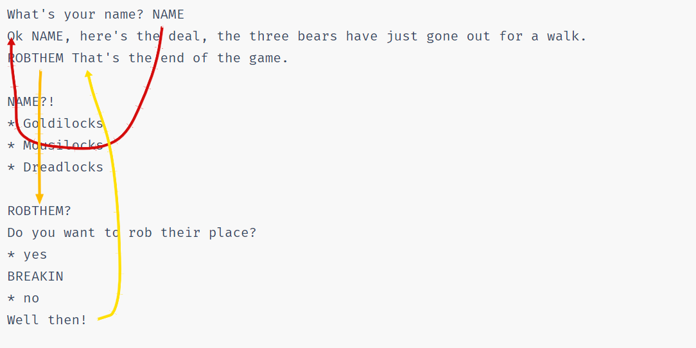
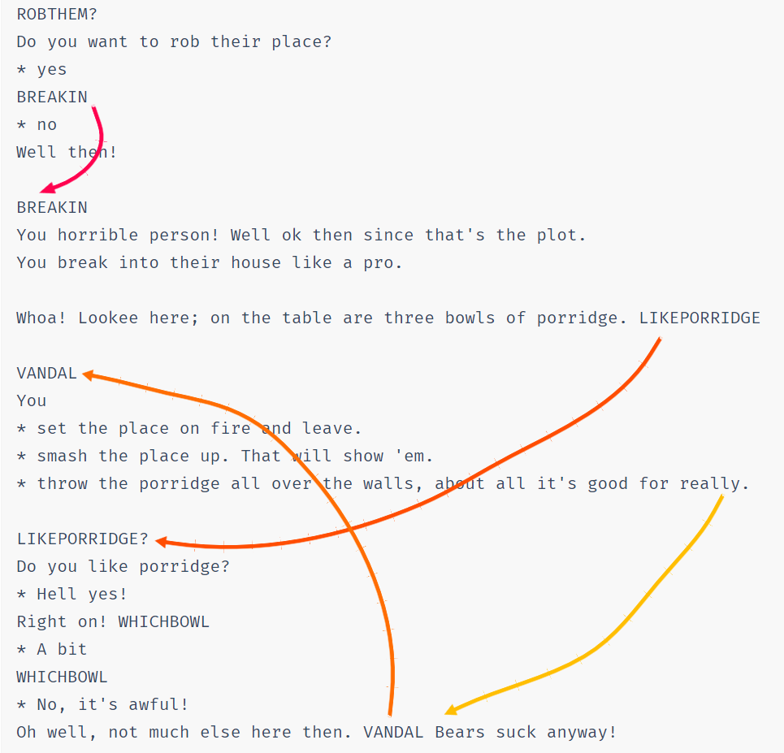
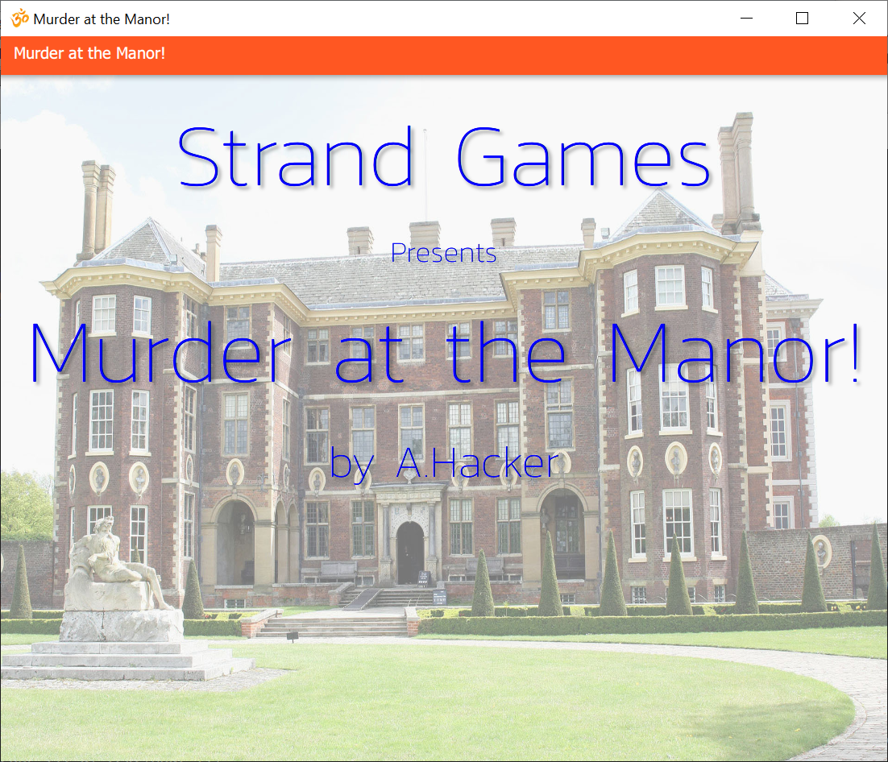
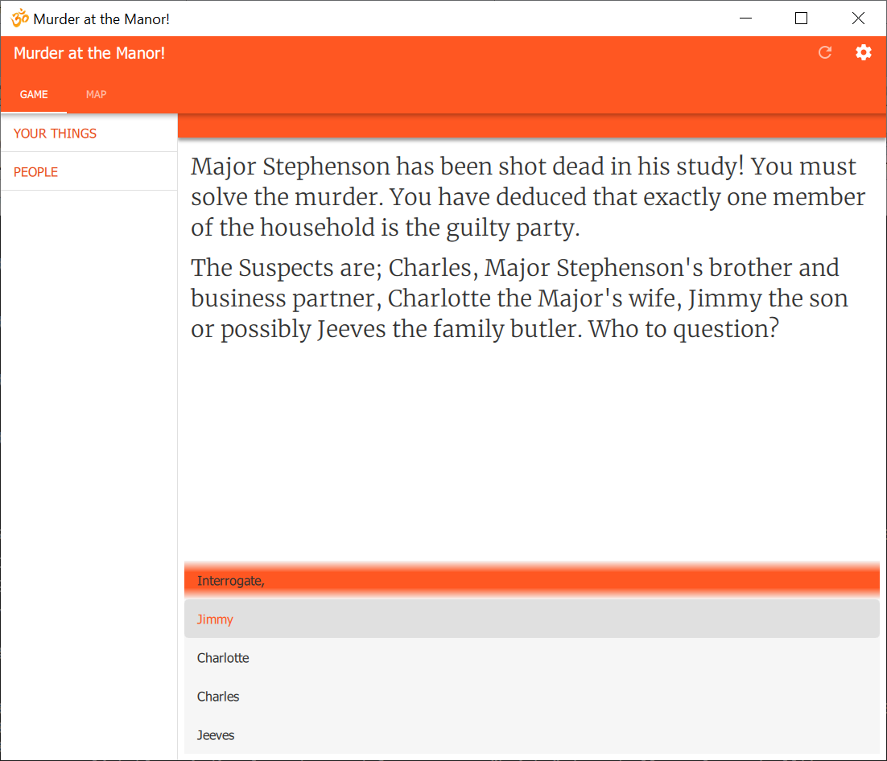
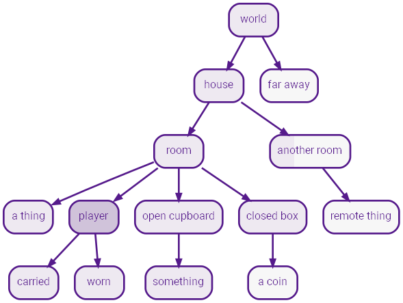
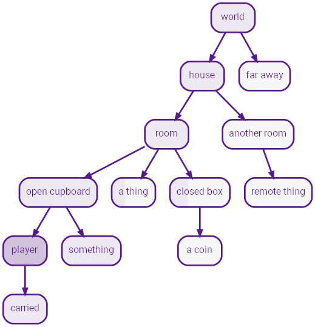

# Strand IF Authoring

## Introduction

### Terms

_Flow_ is a fundamental concept. Flow is the way in which the event sequence of a story unfolds.

Here is a story;

```
STORY
Once there were three bears, then they all died!
The End.
```

OK, not a very exciting story (or even very original), but it illustrates the building block called the _term._;

**Anything in capital letters is a _term_ and the rest is _flow._**

`STORY` is a _term_ and the text, "Once there were three bears, then they all died! The End." is its _flow._ Let's run this story and see the output;

> Once there were three bears, then they all died! The End.

You may have noticed the line break in the `STORY`, before "The End", does not appear in the output. Line breaks in text flows are ignored.

You can however have blank lines in text flow, for example;

```
STORY
Once there were three bears, then they _all_ **died!**

**The End.**
```

Produces the output;

> Once there were three bears, then they _all_ **died!**
>
> **The End.**

Notice you can use markdown in text to indicate **bold** and _italic._

Let's put in some more terms;

```
STORY
ONCE there were THREE bears, then they all died!
The End.

ONCE
Once

THREE
three
```

This produces the exact same output as before, except now the terms `ONCE` and `THREE` emit their own flow.

NOTE: Sometimes you want a capitalised word in the text. In this case, just prefix the word with `\` (backslash) to escape it. Examples: `\OK`, `\TV`. For frequent cases, you can make a term which returns the text, eg:

````
OK
\OK
```


### Selectors

Now, we can give these terms branching flow using _selectors._ For example;

```
STORY
ONCE there were THREE bears, then they all died!
The End.

ONCE
* Once
* Once upon a time
* A long time ago

THREE
* two
* three
* four
* five
```

The term `ONCE` has three _selectors_ which give alternative flows. `ONCE` will choose one of the three selectors _randomly._ The same for `THREE`.

Now we get random stories, each time we run!

> Once upon a time there were five bears, then they all died! The End.

> A long time ago there were four bears, then they all died! The End.

So, just with these bear-bones (sic) basics, we can already make stuff;

```
STORY
ONCE there were THREE bears, PART1. DIED. THEEND

ONCE
* Once
* Once upon a time
* A long time ago

THREE
* two
* three
* four
* five

PART1
* they were forced into lockdown in their HOUSE
* they all lived in a HOUSE

HOUSE
* small cottage
* tiny house
* woodland shack
* garden shed

DIED
Unfortunately they
* contracted VIRUS
* were poisoned by POISON

  and died

POISON
* tainted porridge
* a little blond girl
* dodgy mushrooms

VIRUS
* Covid19
* a nasty flu
* tuberculosis
* the plague

THEEND
* The End.
* It's all over.
* That's the end!
```

Some sample outputs;

> A long time ago there were five bears, they were forced into lockdown in their garden shed. Unfortunately they were poisoned by a little blond girl and died. It's all over.

> Once upon a time there were two bears, they all lived in a woodland shack. Unfortunately they were poisoned by tainted porridge and died. It's all over.

> Once upon a time there were four bears, they were forced into lockdown in their woodland shack. Unfortunately they contracted tuberculosis and died. That's the end!

You can have text _before_ selectors and/or more text _after_ selectors (eg `DIED`) but you **cannot have more than one set of selectors in a term**. You'll see why in the next section.


### Sticky Selectors

A problem with random selectors is that sometimes you need to pick something at random and then stick with it. For example, a person's name.

Here's an example where we want to be random, but maintain consistency;

```
STORY
MARY had a little LAMB its FLEECE was WHITEASSNOW.
And everywhere that MARY went, the LAMB was sure to go.

MARY!
* Mary
* Larry
* Barry
* Harry
* Gary
* Sally

LAMB!
* lamb
* chicken
* puppy
* dog
* cat

FLEECE
* fleece
* coat
* fur
* tail

WHITEASSNOW
* white as snow
* red as blood
* green as grass
* pink as a fairy
* blue as sky
```

In this example, the terms `MARY` and `LAMB` have the _indicator_ `!` after their definition, but not their usage in the `STORY`.

The `!` indicates the term is _sticky._

A _sticky_ term is one whose flow occurs just _once_ and thereafter the flow output remains the same.

Here's some outputs;

> Larry had a little puppy its fur was green as grass. And every where that Larry went the puppy was sure to go.

> Harry had a little chicken its tail was red as blood. And every where that Harry went the chicken was sure to go.

Unfortunately, it doesn't always rhyme anymore!

There are other indicators you can apply to a term such as ones to control the ordering, the randomness and so on.

### Term Indicators

These affect the manner in which selectors are used.

Here are the possible term indictors, many of these are explained later.

Indicator | Name | Description 
-- | -- | -- 
`!` | sticky | Runs flows _once_ thereafter emits the same output.
`&` | shuffle | Selectors are "shuffled" and executed in a random order.
`#` | nonrandom | Selectors chosen with biased random preventing starvation.
`<` | sequence | Selectors run in order.
`=` | first | First valid selector is run.
`?` | choice | Term is a choice.
`@` | object | Term is an object.

### Choices

So far we've only covered terms used as generators. But;

**The difference between a player choice and a generator is whether the choice is made by the _player_ or by the _machine._**

When you want to make a player choice, you use the _exact same syntax_ but mark the term as a choice using `?`.

Here's a new story to illustrate;

```
STORY
Once upon a time there were three bears.

What's your name? NAME
Ok NAME, here's the deal, the three bears have just gone out for a walk.
ROBTHEM That's the end of the game.

NAME?!
* Goldilocks
* Mousilocks
* Dreadlocks

ROBTHEM?
Do you want to rob their place?
* yes
BREAKIN
* no
Well then!

BREAKIN
You horrible person! Well ok then since that's the plot.
You break into their house like a pro.

Whoa! Lookee here; on the table are three bowls of porridge. LIKEPORRIDGE

VANDAL
You
* set the place on fire and leave.
* smash the place up. That will show 'em.
* throw the porridge all over the walls, about all it's good for really.

LIKEPORRIDGE?
Do you like porridge?
* Hell yes!
Right on! WHICHBOWL
* A bit
WHICHBOWL
* No, it's awful!
Oh well, not much else here then. VANDAL Bears suck anyway!

WHICHBOWL
There are three bowls; a large one, a medium one and a small one. BOWL

BOWL?
Which do you want to try NAME?
* the biggest of course!
Eww! It's cold and lumpy! BOWL
* the medium sized one
Eww! It's way too sweet! BOWL
* the smallest one
This one's not too bad. A bit small though, so you eat the lot!
Suddenly the door slams open and three angry bears are glaring right at you! WHATNOW

WHATNOW?
What now?
* Run like hell!
Nice try, but they swiftly block your exit. MAULED
* Climb a tree.
Be serious, there are no trees in here! WHATNOW
* Put your hands up and plead innocent.
Sorry, the cute routine doesn't work with bears! MAULED
* Say; NAME went that-a-way, and point out the window!
It worked! The bears all rush out to find the culprit.
Quickly, you exit the shack and run away as fast as you can. That was close! MORAL
* Fight!
You rush them, kicking and screaming like a banshee, perhaps they'll run off? MAULED

YOUDIE
They
* leave you to die slowly and painfully,
* watch you die slowly, your blood squirting out in slow motion,
* laugh as you die screaming in agony,

  while they eat their porridge!

VICIOUSLY
* viciously
* ferociously
* mercilessly
* easily

MAULED
The bears grab you and VICIOUSLY tear all your arms and legs off! Bears are _that_ strong you know. YOUDIE MORAL

MORAL
Perhaps you won't mess with bears next time!
```

Let's see how this plays and explain the details;

> Once upon a time there were three bears.
> 
> What's your name?
> (1) Goldilocks
> (2) Mousilocks
> (3) Dreadlocks
> 2
> 
> 
> Ok Mousilocks, here's the deal, the three bears have just gone out for a walk. Do you want to rob their place?
> (1) yes
> (2) no
> 2
> 
> Well then! That's the end of the game.

The flow taken by this short playthrough is illustrated here;



Here's another, slightly longer play;

> Once upon a time there were three bears.
> 
> What's your name?
> (1) Goldilocks
> (2) Mousilocks
> (3) Dreadlocks
> 1
> 
> 
> Ok Goldilocks, here's the deal, the three bears have just gone out for a walk. Do you want to rob their place?
> (1) yes
> (2) no
> 1
> 
> 
> You horrible person! Well ok then since that's the plot. You break into their house like a pro.
> 
> Whoa! Lookee here; on the table are three bowls of porridge. Do you like porridge?
> (1) Hell yes!
> (2) A bit
> (3) No, it's awful!
> 3
> 
> Oh well, not much else here then. You throw the porridge all over the walls, about all it's good for really. Bears suck anyway! That's the end of the game.

Here's the flow this time;




You can see from these flow diagrams that flow enters terms and continues to flow into subterms until there is nowhere for it to go, at which point, it returns to the original flow and continues. When the flow finally stops, the game is over.

Finally, here is a longer play;


> Once upon a time there were three bears.
> 
> What's your name?
> (1) Goldilocks
> (2) Mousilocks
> (3) Dreadlocks
> 1
> 
> 
> Ok Goldilocks, here's the deal, the three bears have just gone out for a walk. Do you want to rob their place?
> (1) yes
> (2) no
> 1
> 
> 
> You horrible person! Well ok then since that's the plot. You break into their house like a pro.
> 
> Whoa! Lookee here; on the table are three bowls of porridge. Do you like porridge?
> (1) Hell yes!
> (2) A bit
> (3) No, it's awful!
> 1
> 
> 
> Right on! There are three bowls; a large one, a medium one and a small one. Which do you want to try Goldilocks?
> (1) the biggest of course!
> (2) the medium sized one
> (3) the smallest one
> 1
> 
> Eww! It's cold and lumpy!
> Which do you want to try Goldilocks?
> (1) the medium sized one
> (2) the smallest one
> 2
> 
> 
> This one's not too bad. A bit small though, so you eat the lot! Suddenly the door slams open and three angry bears are glaring right at you! What now?
> (1) Run like hell!
> (2) Climb a tree.
> (3) Put your hands up and plead innocent.
> (4) Say; Goldilocks went that-a-way, and point out the window!
> (5) Fight!
> 2
> 
> Be serious, there are no trees in here!
> What now?
> (1) Run like hell!
> (2) Put your hands up and plead innocent.
> (3) Say; Goldilocks went that-a-way, and point out the window!
> (4) Fight!
> 1
> 
> Nice try, but they swiftly block your exit. The bears grab you and viciously tear all your arms and legs off! Bears are _that_ strong you know. They leave you to die slowly and painfully, while they eat their porridge! Perhaps you won't mess with bears next time! That's the end of the game.

It should now be clear how the flow works in this playthrough, but let's look at choice terms in a detail;

```
LIKEPORRIDGE?
Do you like porridge?
* Hell yes!
Right on! WHICHBOWL
* A bit
WHICHBOWL
* No, it's awful!
Oh well, not much else here then. VANDAL Bears suck anyway!
```

`LIKEPORRIDGE` is a choice term as indicated by `?`. It has an (optional) initial text flow `Do you like porridge?`, then it has three selectors each introduced by `*` at the start of a line.

You'll notice each selector has two parts:

* The _choice_ flow on the same line as `*`.
* The _action_ flow on the subsequent lines.

eg

```
* Hell yes!   // choice flow
Right on! WHICHBOWL // action flow
```

If the choice is selected, the _action_ flow is taken. Terms can also occur in the choice flow as `NAME` in the following;

```
BOWL?
Which do you want to try NAME?
* the biggest of course!
Eww! It's cold and lumpy! BOWL
* the medium sized one
Eww! It's way too sweet! BOWL
* the smallest one
This one's not too bad. A bit small though, so you eat the lot!
Suddenly the door slams open and three angry bears are glaring right at you! WHATNOW
```

You'll also notice some of the actions in the `BOWL` term reference `BOWL` itself. This causes a loop back to the `BOWL` term.

By default, choice terms remember which choices have previously been used and these do not appear again. For example the option `Climb a tree` did not appear again when the options were presented again. The same happened as the different porridge bowls were chosen. 

It turns out that selectors can also have indicators, and this can be used to tweak behaviour. eg. Indicating `*+ Climb a tree.` allows the option to be used more than once.

### Conditionals

We can give selectors conditionals to allow them to be affected by previous choice decisions.

**Selectors can be conditional in _both_ generator _and_ choice terms.**

The good news for non-programmers is that there are no, programming style, _variables_ in this language. Instead conditionals are built from whether terms have been visited or not.

_Programmers' note: Don't panic; you can have code flows!_

As usual, here's a mini game, and then some explaination.

```
STORY
Once upon a time there was a boy called Jack. He lived with his widowed mother. They were very poor. All they had was a cow.

You are Jack. One day your old mother says you must take the cow and sell it at the market, as there is no money left for food.

Along the way you meet OLDMAN, he offers you some "magic beans" in exchange for the cow. DOSELL \nThe End.

OLDMAN
* a demented
* a funny looking
* a peculiar
* an incontinent

  old man with a white beard

BODYPART&
* shins
* head
* groin
* chest

DOSELL?
Do you?
* Trade the cow for the beans.
You give the cow to the old man and pocket the beans, almost immediately regretting the decision. What will you poor old mother say? You return home. GOTBEANS
She throws the beans out the window, "No dinner for you!". You go to bed.
\nYou wake up next morning to discover a giant "beanstalk" in the garden, rising far up into the clouds. CLIMB
* Reject the stupid old man's offer
You tell him to get stuffed!
CASHCOW POOR
* Kick him in the BODYPART and take his beans!
ATTACKMAN

ATTACKMAN
* Oof! The old man doubles up in pain and collapses! You take his silly beans and kick him in the BODYPART for good measure. CASHCOW GOTBEANS "Oh well!" and chucks the beans in the curry. POOR
* The old man deftly doges your attack and retaliates. Turns out he's a Kung Foo master (couldn't you tell!). He kicks you right in the BODYPART, flooring you instantly! LOSE

POOR
You got dinner, POORLOSE

POORLOSE
but you're still poor and soon run out of food and starve. LOSE

GOTBEANS
Your mother looks at the beans in disgust, "What's this trash!", she says!

CASHCOW
At the market, you sell the cow for a good price and return home.
Your mother cooks a giant curry with the money from the cow.


CLIMB?
DOCLIMB do you?
*?!CHICKEN Climb the beanstalk
ATTOP
*+?CHICKEN Climb back up the beanstalk
ATTOP
* Go to the pub.
PUB
* Hang around the town like a lemon.
You do that, POORLOSE

DOCLIMB<
* With nothing better to do, 
* This time,

PUB
You go to the pub, and do some cleaning in exchange for a beer, POORLOSE

SMOKE
* crack
* weed
* hashish
* // blank

GIANTDOING
* smoking SMOKE.
* reading the newspaper.
* watching \TV.
* playing a computer game.
* grinding some bones.
* eating toast.

ATTOP?
At the top you see a huge castle fit for a giant. Do you?
* Enter the castle
Inside the castle is an enormous hall.
At the far end sits a huge fat giant, GIANTDOING Luckily he hasn't seen you. In the middle of the room is a table atop of which is; a hen, a magic harp and a bag of old coins. WHATDO
* Climb back down to get some weapons.
CHICKEN

CHICKEN
Chicken! Back at the bottom, you remember you're a pauper and haven't got any weapons. Perhaps if you did you could rob the rich. Or Something. Your mother says, "Get back up that beanstalk and bag us a golden goose, idiot!" CLIMB

WHATDO?
What now?
* Introduce yourself to the giant.
You go up to him, holding out your hand and say, "Hi! I'm Jack, nice to meet you!". INTRO
* Steal the coins
GETCOINS THIEF
* Steal the hen
GETHEN THIEF
* Steal the harp
GETHARP THIEF

INTRO
* The giant shakes your hand saying, "Hi I'm a giant, would you like some tea?"
You accept and have a nice little chat about all the problems giants have who live atop of beanstalks and what bad press they get. Presently you bid farewell and climb down. Its always good to make new friends, POORLOSE
* The giant grabs your hand, holds you down, then bites your head clean off! He kicks your head around the room for amusement then gets to work grinding your bones. LOSE

THIEF
You thief! SOUND He bellows;

Fee-fi-fo-fum!
\nI smell the blood of an Englishman,
\nBe he alive, or be he dead,
\nI'll grind his bones to make my bread!
\n\nRUNAWAY

SOUND
*?GETCOINS The giant hears the sound of the coins jangling.
*?GETHEN The Hen squawks as you grab it alerting the giant.
*?GETHARP The strings of the harp strum a note which alerts the giant.

RUNAWAY?
You run like hell! But the giant's huge stride is catching you fast. You;
* Hide under a table.
Nice try, the giant lifts the table then pounds it back down squashing you to death! LOSE
* Turn and fight the giant.
This is not David and Goliath you know! With a single punch, the giant knocks you out. You're put into the curry pot and eaten for dinner. That's after he grinds your bones of course! LOSE
* Jump out the window.
A bit risky, but hey!
Dangling on a branch, you only just make it.
You climb down the beanstalk as fast as you can.
At the bottom, you quickly fetch the axe and chop it down.
You hear a crash in the distance. Looks like you had a lucky escape there!
You show BOOTY to your old mother who says, REVIEW

BOOTY
*?GETCOINS the bag of coins
*?GETHEN the hen
*?GETHARP the harp

REVIEW
*?GETCOINS "Wow gold coins! Well done Jack." Later you buy a bigger house and employ servants to do all the grotty jobs you used to do. WIN
*?GETHEN "Only a scrawny hen!" Well i guess we might get some eggs off it. You've no idea if it lays golden eggs as, apparently, it would need to be fed golden nuggets, none of which you have. Instead you feed it grain, but hey it could be worse!
*?GETHARP "We need money, not music!" She tosses it out the window, POORLOSE

WIN
You live happily ever after!

LOSE
You have lost!

GETCOINS
You grab the bag of coins.

GETHEN
You grab the hen.

GETHARP
You take the harp.
```

This mini game of "Jack and The Beanstalk", consists mostly of simple choice terms as we've seen before. A few `\n` are thrown in, to force a newline in the output to make it a bit neater.

You can climb the beanstalk more than once so let's look at the `CLIMB` term;

```
CLIMB?
DOCLIMB do you?
*?!CHICKEN Climb the beanstalk
ATTOP
*+?CHICKEN Climb back up the beanstalk
ATTOP
* Go to the pub.
PUB
* Hang around the town like a lemon.
You do that, POORLOSE

DOCLIMB<
* With nothing better to do, 
* This time,
```

The initial flow of `CLIMB` could just be "do you?", but instead we want to say;

* "With nothing better to do, do you?"
  initially.
* "This time, do you?"
  thereafter.

This is done using the `DOCLIMB` term with a sequential `<` indicator, which will select the options in order and stay on the last thereafter.

At the top of the beanstalk (`ATTOP`), you get the option to climb down, which results in being called a "chicken";

```
CHICKEN
Chicken! Back at the bottom, you remember you're a pauper and haven't got any weapons. Perhaps if you did you could rob the rich. Or Something. Your mother says, "Get back up that beanstalk and bag us a golden goose, idiot!" CLIMB
```

`CHICKEN` flows back to to `CLIMB`. And now we see how `CLIMB` has conditionals dependent on whether `CHICKEN` has been visited;

```
CLIMB?
...
*?!CHICKEN choice text flow
action flow
*+?CHICKEN choice text flow
action flow
```

Selectors can have conditionals which test whether a term has been visited, indicated by `?TERMNAME` for true and `?!TERMNAME` for false.

The `+` sign in the second selector simply allows that to be shown more than once, the first doesn't need to as it can only happen once.

Here are some example conditional selectors;

* `*?TERM` Choice shown if `TERM` is visited.
* `*?!TERM` Choice shown if `TERM` is _not_ visited.
* `*?(FISH and CHIPS)` Choice shown if both `FISH` and `CHIPS` visited.
* `*?(FISH or CHIPS)` Choice shown if any of `FISH` and `CHIPS` visited.
* `*?!(FISH or CHIPS)` Choice shown if neither of `FISH` and `CHIPS` visited.
* `*?(!FISH and !CHIPS)` Choice shown if neither of `FISH` and `CHIPS` visited.
* `*?((FISH and CHIPS) or (CURRY && SPUDS))` You can use "&&" and "||" instead of "and" and "or", if you like.

You can use "not" instead of "!" if you like.

Here's another conditional example from this mini game;

```
SOUND
*?GETCOINS The giant hears the sound of the coins jangling.
*?GETHEN The Hen squawks as you grab it alerting the giant.
*?GETHARP The strings of the harp strum a note which alerts the giant.
```

This term produces different output depending on which item you've chosen to take in the game. Since only one can be true, then only one of the conditions will be true. Remember by default generator terms are _random_, so if there _was_ more than one, then one of the valid selectors would be chosen at random.

### Filters

Finally, let's look at an example using terms as generators, choices, conditionals and _filters_.

A filter is when flow is _input to a term_ so that the input can be matches against selectors. This is useful when you need something like a table of different actions (a bit like a "case" statement in programming).

Here is a mini murder mystery!

```
START
GAME

GAME_TITLE
Murder at the Manor!

GAME_AUTHOR
by A.Hacker

GAME_ORGANISATION
Strand Games

GAME_BACKIMAGE
images/title.jpg

GAME_COVERTEXT
:color:blue,font:Kanit Thin,weight:200

/*

                               +------------------------+
                               |                        |
                               |  Garden                |
                               |                        |
                               |                        |
                               |                        |
                               +-------------+  +-------+
                                             |  |    
                 +------------------+  +-----+  +-------+
                 |                  |  |                |
                 |  Kitchen         |  |                |
                 |                  |  | Dining Room    |
                 +----------+ +-----+  |                |
                       +----+ +-----+  |                |
                       |            |  |                |
                       |            |  |                |
                       |            |  +-----+--+-------+
                       |            |        |  |    
  +-----------------+  |            |  +-----+--+-------+
  |                 |  |            |  |                |
  |                 |  |  Hall      |  |                |
  |                 |  |            |  | Drawing Room   |
  |                 +--+            +--+                |
  |   Study                                             |
  |                 +--+            +--+                |
  |                 |  |            |  |                |
  +-----------------+  +------------+  +----------------+

*/

GAME
Major Stephenson has been shot dead in his study! You must solve the murder.
You have deduced that exactly one member of the household is the guilty party.

The Suspects are; Charles, Major Stephenson's brother and business partner,
Charlotte the Major's wife, Jimmy the son or possibly Jeeves the family butler.
images/map.png

Who to question? QUESTION \nThe end.

// computer randomly picks murderer each game
MURDER!
* Jimmy
* Charlotte
* Charles
* Jeeves

QUESTION
*?!(WIN or LOSE) ASK

ASK?
Interrogate,
*+ Jimmy
JIMMY
*+ Charlotte
CHARLOTTE
*+ Charles
CHARLES
*+ Jeeves
JEEVES
*+?ASK Accuse someone!
ACCUSE

 QUESTION

OKBUT
* I see, but
* But
* Ok, but

PROVE
* OKBUT can you prove that?
* OKBUT how can you prove that?
* OKBUT do you have anything to corroborate that?

WHEREU
* where were you at the time of the murder?
* what were you doing when the murder took place?
* do you have an alabi?

JIMMY?
* Jimmy, WHEREU
JWHERE JPROVE
*?CPROVE Did you see Charles in the drawing room?
JSAY
*?BWHERE Jimmy, did you happen to see Jeeves in the dining room?
JSAY2

JWHERE
* I was in the hall.

JSAY MURDER
* Jimmy
No, the room was empty!
* Charles
No, I don't think so.
*
Yes I did!

JSAY2 MURDER
* jimmy
No, he was definitely in the kitchen.
* Jeeves
I'm pretty sure he wasn't in the dining room.
*
Yes, I saw him setting out the table. 


JPROVE?
* PROVE
Ask Charles because he saw me there.

CHARLOTTE?
* Charlotte, WHEREU
I was in the garden. SPROVE
*?BPROVE Jeeves said he was in the dining room, setting the dinner table. Did you see him?
SSAY

SPROVE?
* PROVE
Ask Jeeves, he saw me through the window.

SSAY MURDER
* Charlotte
No, that's a lie, Jeeves was in the kitchen.
* Jeeves
No, I think Jeeves was in the kitchen.
*
Of course!

CHARLES?
* Charles, WHEREU
I was in the drawing room, CDOING CPROVE
*?JPROVE Was Jimmy in the hall?
CSAY

CDOING
* smoking my pipe.
* reading my book.
* playing solitaire.
* writing my new novel.
* listening to the gramophone.

CSAY MURDER
* jimmy
He was there earlier, but I'm not sure exactly.
* Charles
No, I didn't see him at all.
*
Yes indeed, I saw him there.

CPROVE?
* PROVE
Jimmy came to see me, ask him.

JEEVES?
* Jeeves, WHEREU
I was in the dining room, preparing the dinner table. BPROVE
*?SPROVE Did you see Charlotte doing the gardening?
BSAY
*?JWHERE Did you see Jimmy in the hall?
BSAY2

BPROVE?
* PROVE
BWHERE

BWHERE
Certainly sir, ask Charlotte, she saw me preparing the dinner table.

BSAY MURDER
* jeeves
No, she's finished that some time before.
* Charlotte
She did do some gardening, but I think she'd finished by then.
* 
Yes, I distinctly remember seeing her through the window.

BSAY2 MURDER
* jimmy
No, I can't recall seeing him.
* Jeeves
He wasn't in the hall, I remember that.
*
Yes, I did see him there actually.

ACCUSE?
Accuse,
* Jimmy
CHKJ
* Charlotte
CHKS
* Charles
CHKC
* Jeeves
CHKB

CHKJ MURDER
* jimmy
WIN
*
LOSE

CHKS MURDER
* charlotte
WIN
*
LOSE

CHKC MURDER
* charles
WIN
*
LOSE

CHKB MURDER
* jeeves
WIN
*
LOSE

WIN
Well done! The murderer was indeed MURDER! ISBUTLER

LOSE
Sorry, wrong answer, the real murderer was MURDER. ISBUTLER

ISBUTLER MURDER
* jeeves
Yes I know, the butler did it!
```

In this game, a random character is picked each time as the murderer and _you_ have to sluth it out!

Most of the contructs we've already covered. The game uses a sticky version of `MURDER` to initially choose the villian.

The main loop is;

```
QUESTION
*?!(WIN or LOSE) ASK

ASK?
Interrogate,
*+ Jimmy
JIMMY
*+ Charlotte
CHARLOTTE
*+ Charles
CHARLES
*+ Jeeves
JEEVES
*+?ASK Accuse someone!
ACCUSE

  QUESTION
```

The tail flow on `ASK` loops back to `QUESTION`. Note the indent of `QUESTION` which attaches it to `ASK` as a tail flow rather than looking like a new term definition.

`QUESTION` uses the conditional selector, `*?!(WIN or LOSE)` to determine if the game is over, since if `WIN` or `LOSE` have been set, `QUESTION` will return and flow will end.

All of the `ASK` selectors use the `+` indicator as they can be visited more than once, and the final "Accuse someone" choice is conditional on whether `ASK` has been visited before (which it hasn't the first time).

The gameplay is based on the idea of suspects responses being different depending on whether they are guilty or innocent; the murderer is deceptive and the innocent always tell the truth.

For example, when asking `JIMMY?` "Did you see Charles in the drawing room?", we arrive at the `JSAY` term;

`JSAY` is a _filter_.

```
JSAY MURDER
* Jimmy
No, the room was empty!
* Charles
No, I don't think so.
*
Yes I did!
```

The `JSAY` term definition has the term `MURDER` next to it. This is called a _topflow_ and turns the `JSAY` term into a "case matching" filter.

What happens is the _topflow_, in this case `MURDER`, is evaluated and it output is _fed into `JSAY`._ for matching.

So, we know `MURDER` has one of the following values;

```
MURDER
* Jimmy
* Charlotte
* Charles
* Jeeves
```

The `JSAY` filter compares `MURDER` to its selectors in order, where instead of the choice being random or a player choice, the _choice is made by the case match._

Now we see that when Jimmy is asked, "Did you see Charles in the drawing room?", if he _is_ the murderer, he will say "No, the room was empty!" Because he's lying!

And if Charles is the murderer, Jimmy will say, "No, I don't think so." because Charles wasn't in the drawing room (he was out murdering!), but Jimmy can't be completely certain - he's a kid after all.

And if neither Jimmy nor Charles is the murderer, then Jimmy was certain to see Charles in the drawing room all the time, and says, "Yes I did!"

Similar constructs are used for the other game suspects. By interrogating their corroborative statements, you can deduce the villain.

So let's look at how it works when you accuse someone;

```
ACCUSE?
Accuse,
* Jimmy
CHKJ
* Charlotte
CHKS
* Charles
CHKC
* Jeeves
CHKB

CHKJ MURDER
* jimmy
WIN
*
LOSE

CHKS MURDER
* charlotte
WIN
*
LOSE

CHKC MURDER
* charles
WIN
*
LOSE

CHKB MURDER
* jeeves
WIN
*
LOSE
```

Here, the `ACCUSE` term simply invokes a number of filter terms that separately check whether your accusations matches `MURDER`, invoking either `WIN` or `LOSE`.

For example;

```
CHKB MURDER
* jeeves
WIN
* // catch all other cases
LOSE
```

Either jeeves matches `MURDER` or not. An empty filter match acts as the catch all "else" case and therefore collects all other cases.

And that's all there is to it! Happy sleuthing!

One final note is you can add game meta-data, eg:

```
GAME_TITLE
Murder at the Manor!

GAME_AUTHOR
by A.Hacker

GAME_ORGANISATION
Strand Games

GAME_BACKIMAGE
images/title.jpg

GAME_COVERTEXT
:color:blue,font:Kanit Thin,weight:200
```

This is used to generate the cover page in the GUI,



The Stands engine can feed the GUI so the choices appear as selections;



## Fundamentals of Parser Games

We now move on to building parser games.

We also have everything described so far at our disposal, so we can build mixed parser and choice games, using an ideal mix of both gameplay strategies.

The difference between a "parser game" and those built so far is that, apart from a parser, we need a _world model._

The _world model_ is a set of objects, their relationships and their behaviour, ie how they respond to interaction.

### World Models from Scratch

The world is built from objects and these are _terms_ just like we've seen before. So far we've seen terms as generators and as choices, and now we can turn a term into an object using the `@` indicator.

Let's start our new, parser based, mystery game!

```
GAME
Hi! Welcome to homicide, try not to kill people!
What is your name? HARRY
Ok HARRY, you have been assigned to solve the mystery death of professor Jones.
PART1

HARRY?!
* Harry
* Larry
* Barry
* Gary
* Sally

PART1?
\nWhat next?
* Investigate the crime scene?
\OK get's go! CRIMESCENE
* Read the report?
Professor Jones was the leading expert researching the deadly "Rona" virus.
He's been stabbed to death, the evening before he was to present his research findings. Could a rival be involved? 
* Drink some tea?
Sorry, you're out of tea!

  PART1
```

Nothing new here, we just set the scene with a couple of choices to get going and some background. When you're ready to play, flow leads to `CRIMESCENE`, and that's where we go into the world.

To build objects, we (usually) make a hierarchy of types. This way we can attach behaviour at the appropriate level. Object inheritance is described by putting the base types in the _topflow_, like this:

```
CONCEPT@

THING@ CONCEPT

PLAYER@ THING

ROOM@ THING

STUDY@ ROOM
```

These definitions aren't useful on their own as we haven't yet filled out their bodies. For that, we have to know what selectors _mean_ for objects. Selectors for choices _match_ player selection, so;

**Selectors for _objects_ match action _semantics._**

Object selector match can be the _semantics_ of an input command, or it can be a system action.  In any case, object selectors act as _reactors_ to actions and their action flow is taken whenever the selector matches.

Let's see how this works, it's about time to define the `player`.

```
PLAYER@ THING
* name
the player
* name
me
* x it
You're looking good!
* i
INV
* inv
INV
```

An object can be given a `name` (which is a system action), which allows the object to describe how it would like to be identified by the command parser. You can give objects more than one name, for example `the player` and `me`, so that it can be matched by different words, ie _synonyms._

When an object is printed out, it will either be textified by its `name` or you can override this with `label`, eg;

```
PHIPPS@ THING
* name
mr phipps
* label
Mr. Phipps
```

Use `label` in cases where titles and forced ajectives are needed.

Adjectives can be put in with `name`

```
BODY@ THING
> put it in study
* name
the dead body
* x it
XBODY
```

This is how adjectives are defined, you don't have to list them anywhere. They're figured out from the `name` selectors. For example, you could write;

```
BODY@ THING
> put it in study
* name
the dead old cold body
* name
corpse
* name
stiff
```

Whereby the parser would match things like "the dead body", "the body", "body", "the cold dead body", "the dead cold body", "cold corpse", "old stiff" etc.

Bear in mind that on output, in the absence of `label`, adjectives are only emitted to discrimiate multiple objects of the same base word (when in scope). For example, the _red_ key and the _blue_ key, and further, these adjectives will be added in _definition order_ until the object names are distinct.

Now looking back at `player` we see some other selectors reacting to _verbs_;

```
* x it
You're looking good!
* i
INV
* inv
INV
```

Loosely speaking, `i`, `inv` and `x` are verbs. The system does not have predefined verbs (except "put"), so any word can be used as a verb, it's up to you to use what you like. When you use words in selectors in verb position, they are assumed to be verbs and treated as such by the parser.

`it` is just shorthand, you can have instead `x player` if you like.

In the above example, both `i` and `inv` do the same thing, flowing to `INV`, which will generate the inventory. if you want also "take inventory" to work, you wouldn't add it as a reaction to player, instead you'd create an (in scope) "inventory" object.

The last thing to explain is in `BODY`. What is, `> put it in study` ?

This is a _command flow_.

Earlier, we hinted there were various types of _flow_, so far we've seen two flow elements; _text_ flow and _term_ references. Now it's time to confess and reveal the various elements that can comprise flow:

Flow Element Type | Syntax | Note
-- | --
term reference | TERM | Any word in capitals
text | hello world | free-form text
command | > put the pot plant in the plant pot | parser expression
image media | title.jpg | or other image, eg image.png
sound media | music.ogg | only ogg supported!
code | { /* code here */ } | anything in {} is code

If an object definition has command flow before its selectors, this is evaluated at the start, after processing all the objects. So `> put it in study` will result in the dead body being (initially) located in the study.


### Inheritance

Let's go over those base terms again;


```
CONCEPT@
* name
concept
* x it
BORING
* examine it
> x it
* look it
> x it
* l it
> x it

BORING
You don't find anything useful.

THING@ CONCEPT
* name
a thing
* get it
You can't get that.
* drop it
You don't have that!

PLAYER@ THING
* name
the player
* name
me
* x it
You're looking good!
* i
INV
* inv
INV
```

So now we're going to see the point of inheritance and base types. Suppose we type `examine player`, there is no match for this in `player` (only `x player`). But because `player` is a `THING`, `THING` is matched for `examine`, but it's not there either, but because `THING` is `CONCEPT`, we find eventually `examine it` in `CONCEPT`.

But, `examine it` in `CONCEPT` flows to the command `> x it` which winds up matching `x it` in `PLAYER` (as it = player).

So this is how we build verb synonyms. Also we see `look player` and `look at player` will work (since there is no express "look at" match, it falls to "look").

But there's more. Why are there method for `get` and `drop` on `THING`?

That's because "things" are not gettable, so these are catch-alls, the same as `x it` on `CONCEPT` flows to `BORING`, which is a copout generator (there's only one in the example, but you'd have a few for variety).

To make something gettable, make a new term `GETTABLE` like this:

```
GETTABLE@ THING
* get it
DOGET
* drop it
DODROP

DOGET > put it in player
* ok
You get IT.
*
You can't get IT.

DODROP > put it in here
* ok
You drop IT.
XHERE
*
You can't do that.
```

How does this work? Well, actually there's nothing conceptually new here.

Let's say you're getting something that's `GETTABLE`, you'll match `get it` in GETTABLE, which flows to `DOGET`.

Now, `DOGET` has a command as a _topflow_ !!

Which means `> put it in player` is evaluated and the result ("ok" or not), matched by the selectors of `DOGET` - recall that, terms with topflows are filters! So this structure is used to test whether `put` worked or not and generate appropriate output.

For comparison, suppose instead we'd had;

```
GETTABLE@ THING
* get it
> put it in player
IT taken.
* drop it
> put it in here
IT dropped.
```

This would sure work providing it was possible, so for example, `> get note` would work, but then you could type `> get note` _again_ and it would claim `note taken`. You could also attempt to drop things _not being carried!_

So inheritance has taken the mechanics of `get` and `drop` out of the object itself and tidied this up to a base class.

We _do_ have a "note" in the game, so we can mark it as `GETTABLE`, then deal specifically with its own methods, such as `> read it`.

```
NOTE@ GETTABLE
* name
the note
* x it
XNOTE
* read it
XNOTE
```

You could have special cases for `> get note` on `NOTE`, perhaps with a condition, that if true would override the default `GETTABLE`.

If you're following this so far, you can see that we _really_ are building worlds from scratch. Even the usual stuff like getting and dropping objects is user defined. As are all the nouns, verbs and adjectives (adverbs too!).

In practice, the material here would constitute a library or "core" module to be included in new games. The reusable core would contain `CONCEPT`, `THING`, `GETTABLE`, `PLAYER` and a bunch of other useful stuff.

We'll finish by defining the inventory and the main loop, then show the complete example.

Earlier we invoked `INV`, how does this work?

```
INV > what is in player
* them
You're carrying, LAST.
*
You're empty handed.
```

Turns out the parser can handle questions as well as commands, so `> what is in player` will result in a _flow_ of terms.

`* them` matches any list, and `* it` matches just one, so the trick above is simply to format the output nicely. Find the inventory, and print them out and also to deal with the case when the list is empty using the catch-all.

Here's the main loop;

```
MAINLOOP
WHATSHERE.
CMD
MAINLOOP

STUFFHERE > what is in here
* PLAYER
*
LAST

WHATSHERE
\nYou can see, STUFFHERE

CMD?
Now what?
*
```

So `WHATSHERE` is just a text introduction to `STUFFHERE`, which runs a query into a filter which _removes the player_ from the list. The result of `STUFFHERE` is thus a flow of object terms, which finally textify themselves.

The only new trick is in `CMD`;

This is an ordinary choice term with a single blank choice. A blank choice means we allow parser input. In general we could mix choices with parser like this;

```
DOWHAT?
* panic
Calm down!
* give up
QUIT
*
```
This would both present choices _and_ allow parser input. We'll be using this later with hybrid parser-choice games.

So here's the complete example. If you play this, you'll notice there's no actual game only a few commands, and those are somewhat rough. To make this polished, the fiddly bits would be hived off to a separate "core" library, clearing the game file for the fun.

```
GAME
Hi! Welcome to homicide, try not to kill people!
What is your name? HARRY
Ok HARRY, you have been assigned to solve the mystery death of professor Jones.
PART1

HARRY?!
* Harry
* Larry
* Barry
* Gary
* Sally

PART1?
\nWhat next?
* Investigate the crime scene?
\OK get's go! CRIMESCENE
* Read the report?
Professor Jones was the leading expert researching the deadly "Rona" virus.
He's been stabbed to death, the evening before he was to present his research findings. Could a rival be involved? 
* Drink some tea?
Sorry, you're out of tea!

  PART1

CRIMESCENE
> put player in study
You arrive at the crime scene.
XHERE
MAINLOOP

XHERE
> x here


CONCEPT@
* name
concept
* x it
BORING
* examine it
> x it
* look it
> x it
* l it
> x it

BORING
You don't find anything useful.

THING@ CONCEPT
* name
a thing
* get it
You can't get that.
* drop it
You don't have that!

PLAYER@ THING
* name
the player
* name
me
* x it
You're looking good!
* i
INV
* inv
INV

ROOM@ THING
* look
XHERE
* l
> look

STUDY@ ROOM
* name
the study
* x it
You're in professor Jones' study. It's a bit of a mess.

BODY@ THING
> put it in study
* name
the dead body
* x it
XBODY

XBODY<
* Professor Jones has been stabbled throught the heart with a knife.
A note falls out the professor's pocket.
> put knife in study
> put note in study
* It's the dead professor.

NOTE@ GETTABLE
* name
the note
* x it
XNOTE
* read it
XNOTE

XNOTE
Scrawled on the paper in crayon is the words, "You'll never get me copper! I'm too clever for you!"


GETTABLE@ THING
* get it
DOGET
* drop it
DODROP

DOGET > put it in player
* ok
You get IT.
*
You can't get IT.

DODROP > put it in here
* ok
You drop IT.
XHERE
*
You can't do that.


KNIFE@ GETTABLE
* name
a knife
* x it
It's a nasty piece of work.

MAINLOOP
WHATSHERE.
CMD
MAINLOOP

STUFFHERE > what is in here
* PLAYER
*
LAST

WHATSHERE
\nYou can see, STUFFHERE

CMD?
Now what?
*

INV > what is in player
* them
You're carrying, LAST.
*
You're empty handed.
```

### Scope

A very important concept not yet mentioned is that of _scope_.

_What is scope?_

Loosely speaking the _scope_, in relation to the player, is _the set of objects the player can interact with at any one time_.

The scope depends on the relationship of objects and changes with that relationship. In theory, every object has a scope, but we are mainly concerned with the scope with respect to the player.

`Strand` models the primary location of objects in terms of containers. 

Here's an example player scope from containers, indicated by shaded boxes.




Approximately, the player scope is:

1. Anything inside the player (recursively), for example carried items, clothing and body parts.
2. The object containing the player (the _player location_).
3. All objects containing the player location up to the root.
4. All objects (recursively) inside the player location, unless inside closed containers.

These rules overlap somewhat, but some concepts like the _player location_ is an important concept in its own right.

From the diagram we can see objects the player can currently access. For example, the player could `> examine a thing` and it would be in scope. Also the `open cupboard` and `something` inside it is also in scope.

The `closed box` is in scope, but `a coin` is not.

You can also see that `far away` places aren't in scope, nor is the `remote thing` in `another room`.

But wait, `another room` is partially shaded, is it in scope?

We now come to the problem of there being slightly different kinds of scope. There's the _interactive scope_, ie things you can examine, pick up and interact with, and then there's the _reference scope_, which are things you can mention at but not actually reach.

For example, in a game which says "East of here is the dining room", you'd expect to be able to say `> go into the dining room`. But the dining room is _not_ in the interactive scope, but you can reference it!

Other times the reference scope differs from the interactive scope is for things like;

1. Objects seen at a distance through a window.
2. Objects inside transparent closed containers.
3. Objects in the "room" when the player is inside something like a cupboard.

Turns out (3) is really no different than before. The following diagram shows the scope when the player climbs into the `open cupboard` (if that's possible). The other items previously in the room are no longer in the _interactive scope_, but only the _reference scope_.




Some final notes about scope and containers;

Not shown in the diagram is the fact that objects are _not_ restricted to a single container. In other words an object has a _set of containers_.

Why would you ever want something in two places at once?

Although not possible in the real world (presumably), this is convenient for game worlds.

Game world objects that benefit from being in multiple locations:

* _Doors_
  A door is a threshold between two locations when modelled as "rooms". The player can interact with the _same door_ from both locations and its state is reflected in both. For example, if the door can be either open or closed, then it is seen as so from _both_ adjacent locations. If the door is "broken", then that state is also common.

* _Some scenery objects_
  Let's say you have a river that flows through various locations. The river, the water and all things connected to it are in _all those locations_. `Strand` minimises this type of object by supporting nested locations, so for example the `house walls` can be in the `house` and be brought into scope for all the house rooms.

## Building Worlds with the Core Library

In the previous sections we were building absolutely everything from scratch.
This isn't necessary, nor is it really necessary to customise the fundamentals of world building.

The `core.str` library has been put together to contain a standard template for building parser worlds. It has everything we've seen already (and more) predefined so all you need to do is drop it into your project to get started.

Let's see how you can use this to get started right away, without even having to understand how it works.

We're going to revisit our old friend "Murder at the Manor", except this time, we're going to turn it into a traditional parser game.

### File Organisation

```
murdermanor
│   story.str
│   map.str
│   murdermanor.str
│   core.str
│   ...
│
└───images
│       title.jpg
│       map.png
│       hall.jpg
│       study.jpg
│       ...
│       
└───sounds
        ...
        
```

We're going to split the Strands into multiple `.str` files, and put the media into subdirectories. `core.str` can just be copied in unmodified, and for the others we have:

File | Description
-- | --
story.str | front end meta-data
map.str | location layout
murdermanor.str | main game defition
core.str | system library

One way to get started is to copy the `murdermanor` sample and hack it!

### Meta Data

These live in `story.str`, which will be the initial file to load and will specifiy the other files needed for the runtime.

Here's what it looks like:

```
START
INITCORE
STORY

GAME_FILES
core.str map.str murdermanor.str

GAME_TITLE
Murder at the Manor

GAME_AUTHOR
by A.Hacker

GAME_ORGANISATION
Strand Games

GAME_BACKIMAGE
images/title.jpg

GAME_COVERTEXT
:color:blue,font:Kanit Thin,weight:200

MAP_BACKIMAGE
images/map.png

GAME_META
:ui_ucanvas:false,ui_sidebar:true,autolink:false

GAME_CREDITS
<h1>GAME_TITLE<br/><em>by GAME_ORGANISATION</em></h1>
<h3>Implemented in Strands</h3>
<p>This game was lovingly hacked together using the Strands engine.</p>
<h4>Strand Games Team</h4>
<ul>
<li>Hugh Steers</li>
<li>Stefan Meier</li>
<li>Stefan Bylund</li>
</ul>
<h4>Writing</h4>
<ul><li>An Author</li></ul>
<h4>Art</h4>
<ul><li>An Artist</li></ul>
<h4>Music</h4>
<ul>
<li>A Musician</li>
<li>Additional Music thanks to <a href="http://www.soundimage.org">Eric Matyas</a></li>
</ul>
<h4>Testing</h4>
<ul><li>A Tester</li></ul>
```

Apart from `START` and `GAME_FILES`, none of this is needed in console mode and it's all for the GUI.

Term | Description
-- | --
GAME_FILES | list of other `.str` files needed at runtime.
GAME_TITLE | for GUI cover page
GAME_AUTHOR | for GUI cover pagep
GAME_ORGANISATION | for GUI cover page
GAME_BACKIMAGE | image for GUI cover page
GAME_COVERTEXT | font settings for cover page text
MAP_BACKIMAGE | image for map background
GAME_META | GUI configuration (see `ifi` specification)
GAME_CREDITS | HTML to appear on the GUI credit screen

### Making the Map

There are no new concepts needed to define the game location layout, but it is practical to put all the "rooms" into a separate `map.str` file which also specifies their interconnection.

Here's `map.str`, you'll see how they interconnect:

```
/*

                               +------------------------+
                               |                        |
                               |  Garden                |
                               |                        |
                               |                        |
                               |                        |
                               +-------------+  +-------+
                                             |  |    
                 +------------------+  +-----+  +-------+
                 |                  |  |                |
                 |  Kitchen         |  |                |
                 |                  |  | Dining Room    |
                 +----------+ +-----+  |                |
                       +----+ +-----+  |                |
                       |            |  |                |
                       |            |  |                |
                       |            |  +-----+--+-------+
                       |            |        |  |    
  +-----------------+  |            |  +-----+--+-------+
  |                 |  |            |  |                |
  |                 |  |  Hall      |  |                |
  |                 |  |            |  | Drawing Room   |
  |                 +--+            +--+                |
  |   Study                                             |
  |                 +--+            +--+                |
  |                 |  |            |  |                |
  +-----------------+  +------------+  +----------------+

*/

MANOR@ INSIDE
* name
the manor
* name
house

//////////////////// hall

HALL@ MANOR
* name
the hall
* x it
You're in the hall.
Westwards is the study, east is the drawing room and further north leads to the kitchen.
* w
GOSTUDY
* go study
GOSTUDY
* e
GODRAWINGROOM
* go drawing room
GODRAWINGROOM
* n
GOKITCHEN
* go kitchen
GOKITCHEN

GOHALL
> put player in hall
You go into the hall.
images/hall.jpg
XHERE

///////////////////// study

STUDY@ MANOR
* name
the study
* x it
You're in the study.
Back east is the hall.
* e
GOHALL
* go hall
GOHALL

GOSTUDY
> put player in study
You go into the study.
images/study.jpg
XHERE

///////////////////// drawing room

DRAWINGROOM@ MANOR
* name
the drawing room
* x it
You're in the drawing room.
West leads back to the hall, while the room leads north into the dining room.
* w
GOHALL
* go hall
GOHALL
* n
GODININGROOM
* go dining room
GODININGROOM

GODRAWINGROOM
> put player in drawing room
You go into the drawing room.
images/drawing.jpg
XHERE

//////////////////// Dining room

DININGROOM@ MANOR
* name
the dining room
* x it
This is the dining room, you can go further north out into the garden or back south to the drawing room.
* s
GODRAWINGROOM
* go drawing room
GODRAWINGROOM
* n
GOGARDEN
* go garden
GOGARDEN

GODININGROOM
> put player in dining room
You go into the dining room.
images/dining.jpg
XHERE

//////////////////// Garden

GARDEN@ OUTSIDE
* name
the garden
* x it
You're outside in the garden.
An exit south leads back into the house.
* s
GODININGROOM
* go dining room
GODININGROOM

GOGARDEN
> put player in garden
You go into the garden.
images/garden.jpg
XHERE

////////////////// kitchen

KITCHEN@ MANOR
* name
the kitchen
* x it
You're in the kitchen.
The south exit takes you back into the hall.
* s
GOHALL
* go hall
GOHALL

GOKITCHEN
> put player in kitchen
You go into the kitchen.
images/kitchen.jpg
XHERE
```

Here, we define our six locations. The location descriptions are deliberately terse, to make things easier to see.

Firstly, we've defined a holding location, `MANOR` which is a base for everthing except the garden. An `INSIDE` has walls and is defined in `core.str`. Anything we want to add generally to the manor can go here.

Let's examine the `HALL` in detail, the rest are all similarly constructed.

We give it a `name` and a description with `x it`, then we define reactors to move to the study, the kitchen and the drawing room. So `go study` flows to `GOSTUDY` as does `w`.

We add reactors like `n`, `s`, `e`, `w`, if we want to support compass directions. You only need thes if you want to support traditional compass navigation. You don't need to worry about the other ways to move, since `core.str` maps variants like `go west` and `go w` to `w`.

It makes sense to define a term to perform the actual movement, in this case `GOSTUDY`. This is so it can be used anywhere. If we have a "hall", then you probably want a `GOHALL` as well.

```
GOSTUDY
> put player in study
You go into the study.
images/study.jpg
XHERE
```

Is a straightforward term which has a command flow, a text flow, an image flow and finally a term `XHERE` which refreshes the text and updates the top bar on the GUI. `images/study.jpg` will display the location picture.

You can use `.jpg` or `.png` as well as animated PNGs.

One this is all done, you should be able to move about your game!


### Building the main Game

All that's left now is to write the actual game itself :-)


```
STORY
Major Stephenson has been shot dead in his study! You must solve the murder.
You have deduced that exactly one member of the household is the guilty party.

The Suspects are; Charles, Major Stephenson's brother and business partner,
Charlotte the Major's wife, Jimmy the son or possibly Jeeves the family butler.
BEGIN

// computer randomly picks murderer each game
MURDER!
* Jimmy
* Charlotte
* Charles
* Jeeves

BEGIN
UPDATEMAP
GOHALL
MAIN
```

### Asynchronous Flow

Timers.


## Building Parser Choice Games

These are games where the player has both choices and text entry _at the same time_.

## Animation

Simple animation can be made as animated PNGs, but complex ones are built using [Spine](http://esotericsoftware.com/). The Strand GUI has the spine 2D animation runtime built in and all that's needed is to drop the spine output files into the `images` folder and use them.


  


