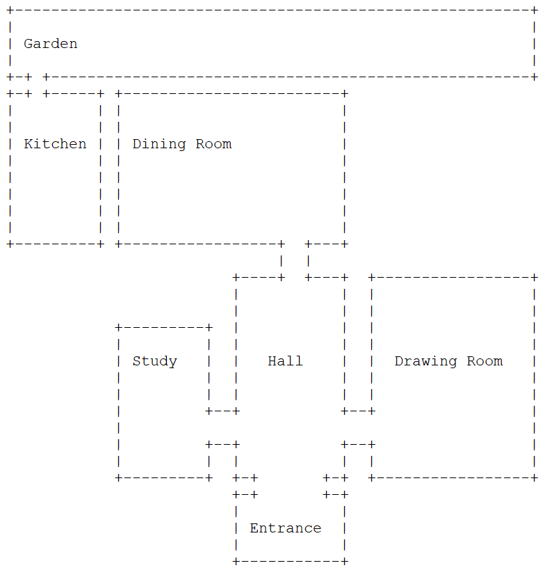

# Picton Murder Whodunnit

* Title: Picton Murder Whodunnit
* Story Author: Sia See, sia@9ize.com

* Short Desc:
  Who shot Major Stephenson: Charles, his brother and business partner, his wife Charlotte, the son Jimmy or even Jeeves the family butler? I don't know either because the villain changes for each game!

* Format: Strand

* Time to complete: about 10 mins.

## How to Play

Click [here](https://stvle.s3.amazonaws.com/picton/index.html)

## Release Notes:

Version: 1.1.02/1.11, for SpringThing 2021.

## About the Game:

Each time you play, the game picks a new villain! So the murderer can be different every time. Be advised, if you refresh the browser page, it will restart the game!

This game uses a mixture of Choice & Parser text input, so this is a bit different than most players are used to. You can play with choices, but parser input can give more detail.

## Acknowledgements

Thanks to Christopher Merriner for beta test.

## Known Problems:

* virtual keyboard does not pop-up on mobile devices.
* Text appears blobby on Firefox if `privacy.resistFingerprinting` has been set.
* No audio in Chrome mobile. Apparently this is due to default autoplay disabled.

