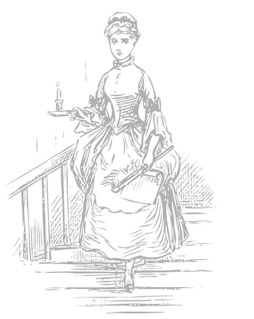

# Cinderella

### A tutorial game.

Strand Games Technology

## Technical Brief

The game will be written in `Strand` and presented with graphic illustrations; backgrounds and characters. Background ambient sounds are possible, as are some animation.

Gameplay will consist of hybrid choice-parser input, where choices are used for character interactions and parser input for "focused choice" and freestyle agency, where practical.

## Intro
Once there was a gentleman who married for his second wife the proudest and most haughty woman that was ever seen. She had by a former husband two daughters of her own humour, who were, indeed, exactly like her in all things. He had likewise, by another wife, a young daughter, but of unparalleled goodness and sweetness of temper, which she took from her mother, who was the best creature in the world.

No sooner were the ceremonies of the wedding over but the mother-in-law began to show herself in her true colours. She could not bear the good qualities of this pretty girl, and the less because they made her own daughters appear the more odious. She employed her in meanest work of the house: she scoured the dishes, tables, etc., and scrubbed madam's chamber and those of misses, her daughters; she slept in the cramped attic, upon a wretched straw bed, while her two sisters lay in fine rooms, with floors all inlaid, upon beds of the very newest fashion, and where they had looking-glasses so large that they might see themselves at their full length from head to foot.

## Chapter 1: Rooms

Cinderella is in the kitchen. There is a pile of plates to wash up. Upstairs in the boudoir, your two sisters, Prunella and Esmeralda, are busy getting ready for something. 

### Notes
The initial game files placed in `src` define two simple rooms with pictures and their initial descriptions. Currently, there are no "sisters" nor objects in the kitchen.

## Chapter 1: Objects
Now add the objects, including the plates that you can wash up and the two sisters. This version is `src2`.

## Chapter 1: Story
Now you can talk to the sisters and they tell you about the invitation to the ball. After this, they tell you to finish _all_ the cleaning, then they leave for the ball.

