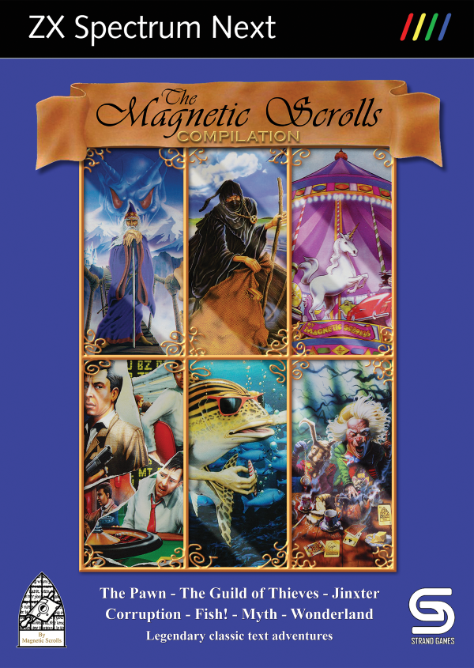

# The Magnetic Scrolls Compilation

### [DOWNLOAD COMPILATION (auto-bootable overlay)](build/magnetic-boot.zip)
### [DOWNLOAD COMPILATION (only the games)](build/magnetic.zip)
### [DOWNLOAD CASE COVER](resources/case-cover.png)
### [DOWNLOAD SD CARD LABEL](resources/sd-card-label.png)

The Magnetic Scrolls Compilation is a compilation of all of Magnetic Scrolls
text adventure games for the ZX Spectrum Next. This compilation is provided as
a convenience if you want to download all the games in a bundle and, optionally,
create your own physical edition of the compilation with a case and cover.
A big thank you to John Blythe for creating the beautiful cover!

Some of the games are remastered versions by Strand Games that contain bug
fixes, playability improvements and, in some cases, additional location images.
The other games are the classic versions that are waiting to be remastered but
are still brilliant in their original form. The *Games* section below contains
more information about each game and which games are remastered. This
compilation will be updated when a game has been remastered or when a game has
been updated with bug fixes or other improvements.

The compilation is provided in two versions: One version that auto-boots from an
SD card and another version containing just the games.

## Create Your Own Physical Edition

Here is an instruction on how to create your own physical edition of The
Magnetic Scrolls Compilation.

Prerequisites: Case and an empty pre-formatted SD card.

1. Go to [specnext.com](https://www.specnext.com/latestdistro) and download the
lite version of the Spectrum Next system software, e.g.
**System/Next distribution v.1.3.2 LITE VERSION**, and unpack it on an empty
pre-formatted SD card.

2. Download [magnetic-boot.zip](build/magnetic-boot.zip) and unpack it in the
root directory of the same SD card. This is an auto-bootable System/Next overlay
that contains all the games and which will overwrite the default autoexec.bas to
provide a start menu where you can select which of the games you want to play.

3. Download [case-cover.png](resources/case-cover.png) and print it on a glossy
A4 paper in landscape mode without margins/border (or max 1 cm margin) and with
scaling set to 100% (i.e. normal size and not "fit to page", "shrink to fit" or
similar). Cut out the printed image.

4. Download [sd-card-label.png](resources/sd-card-label.png) and print it on a
glossy self-adhesive paper with scaling set to 100% (i.e. normal size and not
"fit to page", "shrink to fit" or similar). Cut out the printed image.

5. Put the printed cover on the case and the SD card label on the SD card.

That's it, now you have your own physical edition of The Magnetic Scrolls
Compilation!

## How to Run

The compilation is provided in two versions: One version that auto-boots from an
SD card and another version containing just the games.

There are actually two versions of each game in the compilation:
&lt;game&gt;_512.nex uses the Timex hi-res mode (512 x 192) for displaying the
text and &lt;game&gt;_256.nex uses the standard Spectrum mode (256 x 192).
The auto-bootable compilation uses the Timex hi-res mode version of the games
since they are really the best ones. In the games-only compilation, you can
decide for yourself which version you want to run.

**Note:** When updating the compilation to a newer version and you have save
files that you still want to use, just copy those save files to the new game
folder(s).

### Auto-bootable compilation

Skip steps 1 and 2 if you have already followed the steps in *Create Your Own
Physical Edition*.

1. Go to [specnext.com](https://www.specnext.com/latestdistro) and download the
lite version of the Spectrum Next system software, e.g.
**System/Next distribution v.1.3.2 LITE VERSION**, and unpack it on an empty
pre-formatted SD card.

2. Download [magnetic-boot.zip](build/magnetic-boot.zip) and unpack it in the
root directory of the same SD card.

3. Insert the SD card into your Spectrum Next computer and start it.

4. This will bring up a start menu where you can select which of the games you
want to play.

**Note:** The first time you boot the SD card, you will see the NextZXOS test
screen and have to select which video mode to use (HDMI/VGA/RGB and 50-60 Hz
refresh rate). Your selection is then stored in the machines/next/config.ini
file on the SD card. This is standard procedure for any auto-booting SD card
for the Spectrum Next.

### Games-only compilation

1. Download [magnetic.zip](build/magnetic.zip) and unpack it on an SD card
containing the Spectrum Next system software.

2. Insert the SD card into your Spectrum Next computer and start it.

3. Go to the desired **magnetic/&lt;game&gt;/** directory and run the
**&lt;game&gt;_512.nex** or **&lt;game&gt;_256.nex** program.

### Emulators

The compilation can also be run in the CSpect and ZEsarUX emulators.

#### CSpect Emulator

1. Install the latest version of the [CSpect](https://dailly.blogspot.se/)
emulator.

2. Make sure CSpect.exe is in your PATH or set the CSPECT_HOME environment
variable to the directory where it is located.

3. Download [magnetic.zip](build/magnetic.zip) and unpack it on your PC.

4. Run the batch file **magnetic/&lt;game&gt;/run_cspect.bat** to start the
selected game.

#### ZEsarUX Emulator

1. Install the latest version of the [ZEsarUX](https://github.com/chernandezba/zesarux)
emulator.

2. Make sure zesarux.exe is in your PATH or set the ZESARUX_HOME environment
variable to the directory where it is located.

3. Download [magnetic.zip](build/magnetic.zip) and unpack it on your PC.

4. Run the batch file **magnetic/&lt;game&gt;/run_zesarux.bat** to start the
selected game.

## Games

Here is more information about each game included in this compilation. Games
marked as remastered use the remastered game story file by Strand Games while
games marked as classic use the original game story file.

* [The Pawn (remastered)](../pawn)
* [The Guild of Thieves (remastered)](../guild)
* [Jinxter (remastered)](../jinxter)
* [Corruption (classic)](../corrupt)
* [Fish! (classic)](../fish)
* [Myth (classic)](../myth)
* [Wonderland (classic)](../wonder)

## User Interface

The game screen is divided into three sections. The status bar at the top shows
the current location to its left and the score and number of turns to its right.
The middle section shows the graphics for the current location and the bottom
section is the text area which accepts user input at its prompt. When there are
too many lines of text to display on the screen at once, the message "&lt;MORE&gt;"
will appear at the bottom left of the screen. Pressing any key will continue the
scrolling of the text. The last entered line of input can be edited by pressing
the EDIT key. The graphics can be scrolled up and down using the up and down
arrow keys to make more or less room for the text. If a PS/2 mouse is connected
to the Spectrum Next, it can also be used to scroll the graphics up and down by
dragging it with the mouse or using the mouse wheel.

Note: The status bar is currently missing in Wonderland. Hopefully, it will be
available in the forthcoming remastered version of the game.

The text colour can be changed by cycling downwards or upwards through a palette
of 32 colours by pressing TRUE VIDEO and INV VIDEO, respectively. The default
text colour is light grey.

For remastered games, the game mode can be toggled between remastered and
classic mode by pressing BREAK. By default, the games start in remastered mode.
In classic mode, the bug fixes and playability improvements provided by the
remastered version of the game are ignored. Any additional graphics is also
skipped in classic mode.

The table below shows the special keys used in the games:

| Spectrum Key |   PS/2 Key    |                               Description                                |
|--------------|---------------|--------------------------------------------------------------------------|
| BREAK        | SHIFT + SPACE | Toggle game mode between remastered (default) and classic mode.          |
| EDIT         | SHIFT + 1     | Edit last entered line of input.                                         |
| UP           | SHIFT + 7     | Scroll graphics up.                                                      |
| DOWN         | SHIFT + 6     | Scroll graphics down.                                                    |
| TRUE VIDEO   | SHIFT + 3     | Change text colour by cycling downwards through a palette of 32 colours. |
| INV VIDEO    | SHIFT + 4     | Change text colour by cycling upwards through a palette of 32 colours.   |
| Mouse        | Mouse         | Scroll graphics up and down by dragging it or using the mouse wheel.     |

## Commands

The Magnetic Scrolls interpreter and parser is quite advanced and supports a
rich vocabulary. Below is a list of useful commands if you're new to text
adventures and a list of special commands.

Useful commands:

* north (n)
* south (s)
* west (w)
* east (e)
* northwest (nw)
* northeast (ne)
* southwest (sw)
* southeast (se)
* up (u)
* down (d)
* exits
* enter &lt;location&gt;
* exit &lt;location&gt;
* go to &lt;previously-visited-location&gt;
* look (l)
* wait (z)
* inventory (i)
* take | get &lt;object&gt;
* drop &lt;object&gt;
* examine &lt;object&gt;
* look in | on | under | at | behind &lt;object&gt;
* find &lt;previously-examined-object&gt;
* open &lt;object&gt;
* close &lt;object&gt;
* ask &lt;character&gt; about &lt;something&gt;
* say to &lt;character&gt; "&lt;something&gt;"
* say "&lt;something&gt;"

Special commands:

* save - Save the current game to file.
* load - Load a previously saved game from file.
* restart - Restart the game.
* quit - Quit the game.
* normal/verbose/brief - Select location description mode.
* graphics on/off - Turn graphics on or off.
* score - Print the current score.
* again - Repeat the last command.

## License & Credits

The Magnetic Scrolls interpreter Magnetic is licensed under the terms of the GNU
General Public License version 2 and is copyright (C) 1997-2008 by Niclas Karlsson.

The Magnetic interface for Sinclair ZX Spectrum Next is copyright (C) 2018 by
Stefan Bylund.

The Pawn is copyright (C) 1985-1986 by Magnetic Scrolls Ltd.

The Guild of Thieves is copyright (C) 1987 by Magnetic Scrolls Ltd.

Jinxter is copyright (C) 1987 by Magnetic Scrolls Ltd.

Corruption is copyright (C) 1988 by Magnetic Scrolls Ltd.

Fish! is copyright (C) 1988 by Magnetic Scrolls Ltd.

Myth is copyright (C) 1989 by Magnetic Scrolls Ltd.

Wonderland is copyright (C) 1990 by Magnetic Scrolls Ltd.

The remastered version of The Pawn is copyright (C) 2017, 2019 by Strand Games.

The remastered version of The Guild of Thieves is copyright (C) 2017 by Strand
Games.

The remastered version of Jinxter is copyright (C) 2018 by Strand Games.

The QLStyle font is copyright (C) 2018 by Phoebus Dokos.

The Vortex Tracker II player is copyright (C) 2004-2007 by Sergey Bulba.

The music track in The Pawn is copyright (C) 2004 by Oleg Nikitin (Nik-O).

The music tracks in The Guild of Thieves, Jinxter, Corruption, Fish, Myth and
Wonderland are copyright (C) 1999, 2018, 2011, 2019, 2017 and 1995 by Sergey
Kosov (MmcM).

The start menu is created with SPUI from Stale Pixels.

Case cover and SD card label by John Blythe 2020.
