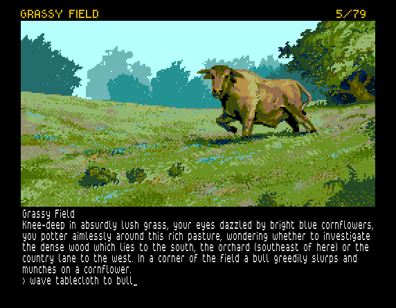
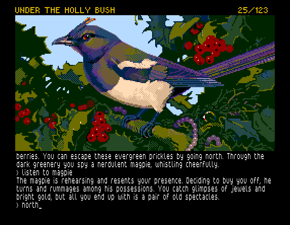
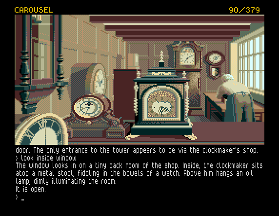
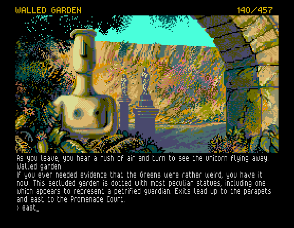

# Jinxter

### [DOWNLOAD](build/jinxter.zip)

This is a conversion of the text adventure game Jinxter for Sinclair ZX Spectrum
Next. Jinxter was released by Magnetic Scrolls in 1987 and was their third game.
As the other Magnetic Scrolls games, it provided premium graphics (on some
systems) in combination with an advanced parser. A text-only version of the game
was released for Spectrum +3. For the first time you can now enjoy Jinxter and
its beautiful graphics on your Spectrum Next. If you need help finding your way
around or want to read more about the game, please visit
[Magnetic Scrolls Memorial](http://msmemorial.if-legends.org/games.htm/jinxter.php).

The game is created using the Spectrum Next porting of the Magnetic Scrolls interpreter
[Magnetic](https://gitlab.com/strandgames/brahman/-/tree/master/zxnext_magnetic)
and the remastered version of the game by [Strand Games](https://strandgames.com/)
containing bug fixes and playability improvements.

The graphics is from the original Commodore Amiga version of the game. The
Amiga version used the same graphics as the Atari ST version, which had 16-colour
images from a palette of 512 colours. These images have been converted to Spectrum
Next's layer 2 graphics format using the
[Next BMP tools](https://github.com/stefanbylund/zxnext_bmp_tools).
The remastered game contains several new location images that have been
downscaled in resolution and colour depth from the SVG originals to fit the
Spectrum Next and then manually touched up.

The game screen is divided into three sections. The status bar at the top shows
the current location to its left and the score and number of turns to its right.
The middle section shows the graphics for the current location and the bottom
section is the text area which accepts user input at its prompt. When there are
too many lines of text to display on the screen at once, the message "&lt;MORE&gt;"
will appear at the bottom left of the screen. Pressing any key will continue the
scrolling of the text. The last entered line of input can be edited by pressing
the EDIT key. The graphics can be scrolled up and down using the up and down
arrow keys to make more or less room for the text. If a PS/2 mouse is connected
to the Spectrum Next, it can also be used to scroll the graphics up and down by
dragging it with the mouse or using the mouse wheel.

The text colour can be changed by cycling downwards or upwards through a palette
of 32 colours by pressing TRUE VIDEO and INV VIDEO, respectively. The default
text colour is light grey.

The game mode can be toggled between remastered and classic mode by pressing
BREAK. By default, the game starts in remastered mode. In classic mode, the bug
fixes and playability improvements provided by the remastered version of the
game are ignored. The additional graphics is also skipped in classic mode.

There are two versions of the game: jinxter_512.nex uses the Timex hi-res mode
(512 x 192) for displaying the text and jinxter_256.nex uses the standard
Spectrum mode (256 x 192). The reason for this is that some monitors may have
problem displaying the Timex hi-res mode properly.

| Spectrum Key |   PS/2 Key    |                               Description                                |
|--------------|---------------|--------------------------------------------------------------------------|
| BREAK        | SHIFT + SPACE | Toggle game mode between remastered (default) and classic mode.          |
| EDIT         | SHIFT + 1     | Edit last entered line of input.                                         |
| UP           | SHIFT + 7     | Scroll graphics up.                                                      |
| DOWN         | SHIFT + 6     | Scroll graphics down.                                                    |
| TRUE VIDEO   | SHIFT + 3     | Change text colour by cycling downwards through a palette of 32 colours. |
| INV VIDEO    | SHIFT + 4     | Change text colour by cycling upwards through a palette of 32 colours.   |
| Mouse        | Mouse         | Scroll graphics up and down by dragging it or using the mouse wheel.     |

## Screenshots







## Video

[](http://stefanbylund.ownit.nu/files/jinxter-video.mp4 "Click to play")

## How to Run

The latest version of this game can be downloaded **[HERE](build/jinxter.zip)**.
This archive contains a directory called jinxter which contains the binaries and
the required resource files. In the descriptions below, the absolute path to the
jinxter directory is denoted as &lt;jinxter&gt;.

The game can be run on the Spectrum Next hardware or in the CSpect and ZEsarUX
emulators.

**Note:** When updating the game to a newer version and you have save files that
you still want to use, just copy those save files to the new game folder.

### Spectrum Next

1. On your PC, unpack the downloaded ZIP file jinxter.zip on an SD card containing
the Spectrum Next firmware. The *.md and *.bat files are not needed and can be
skipped.

2. Insert the SD card in your Spectrum Next computer and start it.

3. Go to the jinxter directory and run the jinxter_512.nex or jinxter_256.nex program.

### CSpect Emulator

1. Install the latest version of the [CSpect](https://dailly.blogspot.se/) emulator.

2. Run the jinxter_512.nex or jinxter_256.nex file in the CSpect emulator:

```
> CSpect.exe -w4 -tv -zxnext -mmc=<jinxter>/ <jinxter>/jinxter_512.nex
```

**Note:** The -mmc path must end with a / or \ character!

**Tip:** For convenience, you can also run the included batch file **run_cspect.bat**.
Make sure CSpect.exe is in your PATH or set the CSPECT_HOME environment variable
to the directory where it is located.

### ZEsarUX Emulator

1. Install the latest version of the [ZEsarUX](https://github.com/chernandezba/zesarux)
emulator.

2. Run the jinxter_512.nex or jinxter_256.nex file in the ZEsarUX emulator:

```
> zesarux.exe --noconfigfile --machine tbblue --enabletimexvideo
  --enablekempstonmouse --tbblue-fast-boot-mode --quickexit
  --enable-esxdos-handler --esxdos-root-dir <jinxter> <jinxter>/jinxter_512.nex
```

**Tip:** For convenience, you can also run the included batch file
**run_zesarux.bat**. Make sure zesarux.exe is in your PATH or set the
ZESARUX_HOME environment variable to the directory where it is located.

## Commands

The Magnetic Scrolls interpreter and parser is quite advanced and supports a
rich vocabulary. Below is a list of useful commands if you're new to text
adventures and a list of special commands.

Useful commands:

* north (n)
* south (s)
* west (w)
* east (e)
* northwest (nw)
* northeast (ne)
* southwest (sw)
* southeast (se)
* up (u)
* down (d)
* exits
* enter &lt;location&gt;
* exit &lt;location&gt;
* go to &lt;previously-visited-location&gt;
* look (l)
* wait (z)
* inventory (i)
* take | get &lt;object&gt;
* drop &lt;object&gt;
* examine &lt;object&gt;
* look in | on | under | at | behind &lt;object&gt;
* find &lt;previously-examined-object&gt;
* open &lt;object&gt;
* close &lt;object&gt;
* ask &lt;character&gt; about &lt;something&gt;
* say to &lt;character&gt; "&lt;something&gt;"
* say "&lt;something&gt;"

Special commands:

* save - Save the current game to file.
* load - Load a previously saved game from file.
* restart - Restart the game.
* quit - Quit the game.
* normal/verbose/brief - Select location description mode.
* graphics on/off - Turn graphics on or off.
* score - Print the current score.
* again - Repeat the last command.

## License

The Magnetic Scrolls interpreter Magnetic is licensed under the terms of the GNU
General Public License version 2 and is copyright (C) 1997-2008 by Niclas Karlsson.

The Magnetic interface for Sinclair ZX Spectrum Next is copyright (C) 2018 by
Stefan Bylund.

Jinxter is copyright (C) 1987 by Magnetic Scrolls Ltd.

The remastered version of Jinxter is copyright (C) 2018 by Strand Games.

The QLStyle font is copyright (C) 2018 by Phoebus Dokos.

The Vortex Tracker II player is copyright (C) 2004-2007 by Sergey Bulba.

The music track "Fragment dh-2018" is copyright (C) 2018 by Sergey Kosov (MmcM).

The new location images are copyright (C) 2018 by Strand Games.
