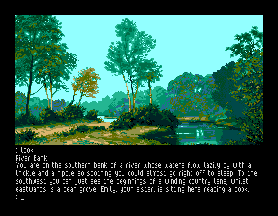
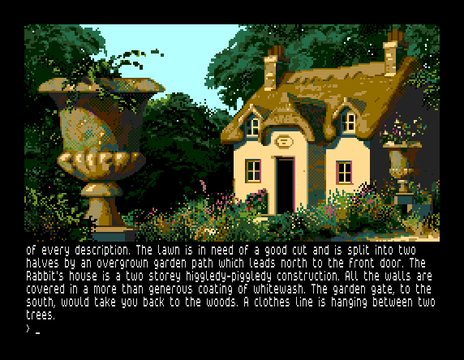
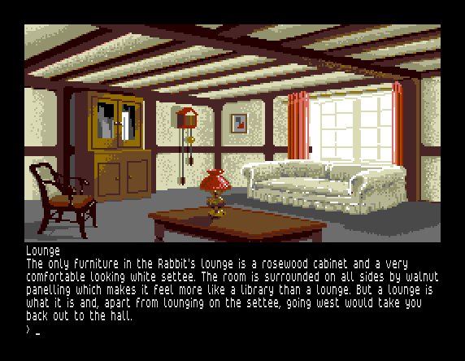
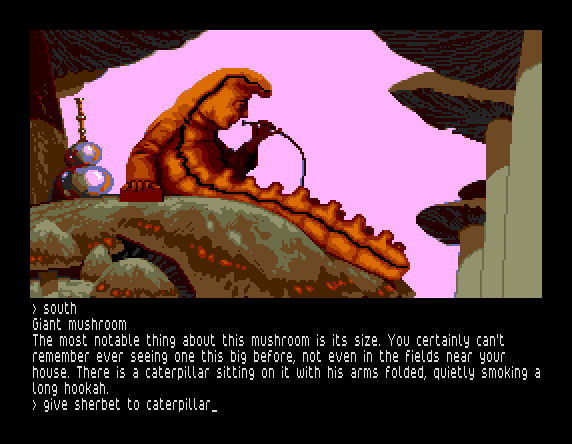
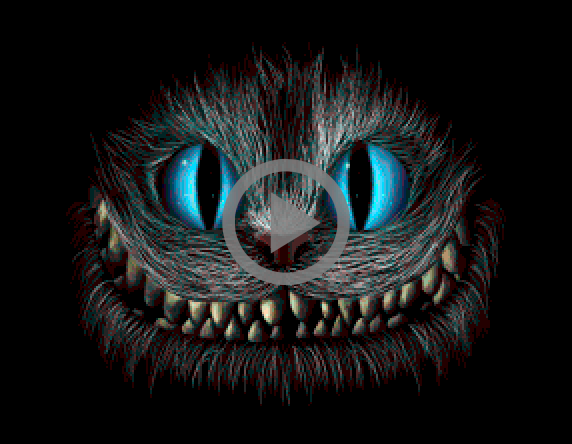

# Wonderland

### [DOWNLOAD](build/wonder.zip)

This is a conversion of the text adventure game Wonderland for Sinclair ZX
Spectrum Next. Wonderland was released by Magnetic Scrolls in 1990 and was their
seventh and last game. Wonderland was the most ambitious game from Magnetic
Scrolls featuring over 100 location images, many of them animated, and a built-in
windowing system called Magnetic Windows with an on-screen map and help system.
In contrast to the previous Magnetic Scrolls games, Wonderland was only available
for 16/32-bit systems. For the first time you can now enjoy Wonderland and its
beautiful animated graphics on an 8-bit computer. This conversion does not
include the Magnetic Windows system but uses the classic user interface, which,
in hindsight, is probably more pleasing to use. If you need help finding your
way around or want to read more about the game, please visit
[Magnetic Scrolls Memorial](http://msmemorial.if-legends.org/games.htm/wonder.php).

The game is created using the Spectrum Next porting of the Magnetic Scrolls interpreter
[Magnetic](https://gitlab.com/strandgames/brahman/-/tree/master/zxnext_magnetic).

The graphics is from the original Commodore Amiga version of the game. The
Amiga version used the same graphics as the Atari ST version, which had 16-colour
images from a palette of 512 colours. The Amiga images and animations have been
converted to Spectrum Next's layer 2 graphics format using a custom tool.

The game screen is divided into two sections.
The top section shows the graphics for the current location and the bottom
section is the text area which accepts user input at its prompt. When there are
too many lines of text to display on the screen at once, the message "&lt;MORE&gt;"
will appear at the bottom left of the screen. Pressing any key will continue the
scrolling of the text. The last entered line of input can be edited by pressing
the EDIT key. The graphics can be scrolled up and down using the up and down
arrow keys to make more or less room for the text. If a PS/2 mouse is connected
to the Spectrum Next, it can also be used to scroll the graphics up and down by
dragging it with the mouse or using the mouse wheel.

The text colour can be changed by cycling downwards or upwards through a palette
of 32 colours by pressing TRUE VIDEO and INV VIDEO, respectively. The default
text colour is light grey.

There are two versions of the game: wonder_512.nex uses the Timex hi-res mode
(512 x 192) for displaying the text and wonder_256.nex uses the standard
Spectrum mode (256 x 192). The reason for this is that some monitors may have
problem displaying the Timex hi-res mode properly.

| Spectrum Key | PS/2 Key  |                               Description                                |
|--------------|-----------|--------------------------------------------------------------------------|
| EDIT         | SHIFT + 1 | Edit last entered line of input.                                         |
| UP           | SHIFT + 7 | Scroll graphics up.                                                      |
| DOWN         | SHIFT + 6 | Scroll graphics down.                                                    |
| TRUE VIDEO   | SHIFT + 3 | Change text colour by cycling downwards through a palette of 32 colours. |
| INV VIDEO    | SHIFT + 4 | Change text colour by cycling upwards through a palette of 32 colours.   |
| Mouse        | Mouse     | Scroll graphics up and down by dragging it or using the mouse wheel.     |

## Screenshots







## Video

[](http://stefanbylund.ownit.nu/files/wonderland-video.mp4 "Click to play")

## How to Run

The latest version of this game can be downloaded **[HERE](build/wonder.zip)**.
This archive contains a directory called wonder which contains the binaries and
the required resource files. In the descriptions below, the absolute path to the
wonder directory is denoted as &lt;wonder&gt;.

The game can be run on the Spectrum Next hardware or in the CSpect and ZEsarUX
emulators.

**Note:** When updating the game to a newer version and you have save files that
you still want to use, just copy those save files to the new game folder.

### Spectrum Next

1. On your PC, unpack the downloaded ZIP file wonder.zip on an SD card containing
the Spectrum Next firmware. The *.md and *.bat files are not needed and can be
skipped.

2. Insert the SD card in your Spectrum Next computer and start it.

3. Go to the wonder directory and run the wonder_512.nex or wonder_256.nex program.

### CSpect Emulator

1. Install the latest version of the [CSpect](https://dailly.blogspot.se/) emulator.

2. Run the wonder_512.nex or wonder_256.nex file in the CSpect emulator:

```
> CSpect.exe -w4 -tv -zxnext -mmc=<wonder>/ <wonder>/wonder_512.nex
```

**Note:** The -mmc path must end with a / or \ character!

**Tip:** For convenience, you can also run the included batch file **run_cspect.bat**.
Make sure CSpect.exe is in your PATH or set the CSPECT_HOME environment variable
to the directory where it is located.

### ZEsarUX Emulator

1. Install the latest version of the [ZEsarUX](https://github.com/chernandezba/zesarux)
emulator.

2. Run the wonder_512.nex or wonder_256.nex file in the ZEsarUX emulator:

```
> zesarux.exe --noconfigfile --machine tbblue --enabletimexvideo
  --enablekempstonmouse --tbblue-fast-boot-mode --quickexit
  --enable-esxdos-handler --esxdos-root-dir <wonder> <wonder>/wonder_512.nex
```

**Tip:** For convenience, you can also run the included batch file
**run_zesarux.bat**. Make sure zesarux.exe is in your PATH or set the
ZESARUX_HOME environment variable to the directory where it is located.

## Commands

The Magnetic Scrolls interpreter and parser is quite advanced and supports a
rich vocabulary. Below is a list of useful commands if you're new to text
adventures and a list of special commands.

Useful commands:

* north (n)
* south (s)
* west (w)
* east (e)
* northwest (nw)
* northeast (ne)
* southwest (sw)
* southeast (se)
* up (u)
* down (d)
* exits
* enter &lt;location&gt;
* exit &lt;location&gt;
* go to &lt;previously-visited-location&gt;
* look (l)
* wait (z)
* inventory (i)
* take | get &lt;object&gt;
* drop &lt;object&gt;
* examine &lt;object&gt;
* look in | on | under | at | behind &lt;object&gt;
* find &lt;previously-examined-object&gt;
* open &lt;object&gt;
* close &lt;object&gt;
* ask &lt;character&gt; about &lt;something&gt;
* say to &lt;character&gt; "&lt;something&gt;"
* say "&lt;something&gt;"

Special commands:

* save - Save the current game to file.
* load - Load a previously saved game from file.
* restart - Restart the game.
* quit - Quit the game.
* normal/verbose/brief - Select location description mode.
* graphics on/off - Turn graphics on or off.
* score - Print the current score.
* again - Repeat the last command.

## Known Problems

The following is a list of known problems in Wonderland:

* The status bar, showing the current location and the score and number of turns,
that is available in the other Magnetic Scrolls games is missing in Wonderland.
Hopefully, it will be available in the forthcoming remastered version of
Wonderland.

* If a location does not have an image, the image of the last visited location
that had an image is displayed. This is just how the game works and not a bug.

## License

The Magnetic Scrolls interpreter Magnetic is licensed under the terms of the GNU
General Public License version 2 and is copyright (C) 1997-2008 by Niclas Karlsson.

The Magnetic interface for Sinclair ZX Spectrum Next is copyright (C) 2018 by
Stefan Bylund.

Wonderland is copyright (C) 1990 by Magnetic Scrolls Ltd.

The QLStyle font is copyright (C) 2018 by Phoebus Dokos.

The Vortex Tracker II player is copyright (C) 2004-2007 by Sergey Bulba.

The music track "Mmcm13" is copyright (C) 1995 by Sergey Kosov (MmcM).
